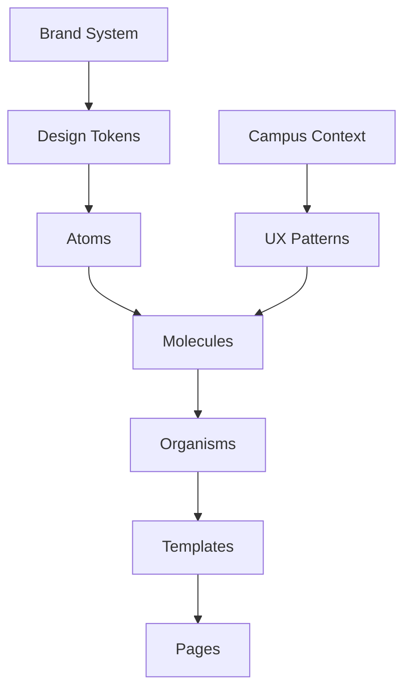

# HIVE Design System Documentation
## Complete Design System Reference & Implementation Guide

**Version:** vBETA  
**Last Updated:** July 2025  
**Status:** Production Ready  

---

## Table of Contents

1. [Design System Overview](#design-system-overview)
2. [Brand System](#brand-system)
3. [Atomic Design Architecture](#atomic-design-architecture)
4. [Design Tokens](#design-tokens)
5. [Component Library](#component-library)
6. [UX Patterns](#ux-patterns)
7. [Implementation Guidelines](#implementation-guidelines)
8. [vBETA to v1 Roadmap](#vbeta-to-v1-roadmap)

---

## Design System Overview

### Vision & Philosophy

**Core Philosophy:** "Empowering Individual Agency Within Community"

HIVE is the first social platform where connections form around solving real problems together. Every design decision balances personal empowerment with community participation, creating **social utility** rather than entertainment.

#### Design Pillars

1. **Student-First Minimalism**
   - Clean, distraction-free interfaces that respect limited attention
   - High-contrast monochrome palette for instant comprehension
   - Typography-driven hierarchy over decorative elements

2. **Customization Without Chaos**
   - Personal dashboard control with systematic constraints
   - Role-based interface adaptation (Student/Faculty/Builder)
   - Consistent patterns that scale across use cases

3. **Privacy Through Clarity**
   - Transparent data visibility controls
   - "Ghost Mode" for selective presence
   - Clear permission states in all interactions

4. **Mobile-Native Thinking**
   - Touch-first interactions with 44px minimum targets
   - Progressive enhancement for desktop
   - Performance as a design feature

5. **Progressive Disclosure**
   - Information revealed based on user context and role
   - Adaptive complexity for novice vs. power users
   - Onboarding that grows with user sophistication

### Platform Context

HIVE operates in the unique intersection of:
- **Academic environments** (course coordination, study groups)
- **Residential communities** (dorm floors, campus living)
- **Social organizations** (Greek life, clubs, interest groups)
- **Creation economy** (HiveLab tools, student-built solutions)

This context drives our design decisions toward **utility-first social interaction**.

---

## Brand System

### Visual Identity

#### Vercel-Inspired Monochrome Aesthetic

**Primary Approach:** Clean monochrome foundation with strategic gold accent

```typescript
// Brand Color System
const brandColors = {
  // Monochrome Foundation (Vercel-inspired)
  black: '#000000',        // Pure black base
  white: '#FFFFFF',        // Pure white
  
  // Gray Hierarchy
  gray: {
    1000: '#0A0A0A',       // Near black backgrounds
    900: '#171717',        // Card backgrounds
    800: '#262626',        // Interactive elements
    700: '#404040',        // Strong borders
    600: '#525252',        // Disabled text
    500: '#737373',        // Placeholder text
    400: '#A3A3A3',        // Secondary text
    300: '#D4D4D4',        // Tertiary text
    200: '#E5E5E5',        // Subtle borders
    100: '#F5F5F5',        // Light backgrounds
    50: '#FAFAFA',         // Off-white
  },
  
  // Single Gold Accent
  gold: '#FFD700',         // ONLY gold used - no variations
  
  // Primary Brand (Vercel Blue)
  blue: '#0070F3',         // Primary actions
}
```

#### Typography System

**Font Hierarchy:**
- **Primary:** Geist Sans (UI, body text)
- **Display:** Space Grotesk (headings, marketing)
- **Monospace:** Geist Mono (code, technical content)

**Mobile-Optimized Scale:**
```typescript
const typography = {
  // Display Scale (Marketing/Hero)
  'display-2xl': '2.5rem',    // 40px - Hero headlines
  'display-xl': '2.25rem',    // 36px - Large headlines
  'display-lg': '2rem',       // 32px - Section headlines
  
  // Heading Scale (Interface)
  'heading-xl': '1.25rem',    // 20px - Main headings
  'heading-lg': '1.125rem',   // 18px - Section headings
  'heading-md': '1rem',       // 16px - Subsection headings
  
  // Body Scale (Content)
  'body-lg': '1rem',          // 16px - Large body text
  'body-md': '0.875rem',      // 14px - Standard body text
  'body-sm': '0.75rem',       // 12px - Small body text
}
```

#### Brand Usage Guidelines

**Gold Accent Usage:**
- **Sparingly for special emphasis** (achievements, premium features)
- **Never as primary action color** (use blue for actions)
- **Consistent single shade** (no gold variations)

**Monochrome Hierarchy:**
- Layer backgrounds: black → gray-900 → gray-800 for depth
- Text contrast: white primary, gray-300 secondary, gray-400 tertiary
- Borders: subtle gray-200 default, gray-700 for emphasis

### Logo System

**HIVE Logo Variants:**
- `hive-logo-black.svg` - For light backgrounds
- `hive-logo-white.svg` - For dark backgrounds  
- `hive-logo-gold.svg` - For special occasions/premium contexts

**Usage Rules:**
- Minimum clear space: 2x logo height on all sides
- Never alter colors, proportions, or add effects
- Always use SVG format for crisp rendering

---

## Atomic Design Architecture

### Complete Component Hierarchy

#### Atoms (Foundation Elements)

**Form Controls:**
- `Button` - Primary action component with size/variant system
- `Input` - Text input with validation states
- `Select` - Dropdown selection with Radix implementation
- `Textarea` - Multi-line text input
- `Checkbox` - Boolean selection control
- `Radio` - Single selection from group
- `Switch` - Toggle control for settings

**Content Display:**
- `Text` - Typography component with semantic variants
- `Badge` - Status/category indicators
- `Avatar` - User profile images with fallbacks
- `Icon` - Lucide icon system with consistent sizing
- `Image` - Optimized image component

**Layout Primitives:**
- `Container` - Responsive content wrapper
- `Spacer` - Consistent spacing control
- `Separator` - Visual content division

**Feedback Elements:**
- `Spinner` - Loading state indicator
- `Skeleton` - Content placeholder during loading
- `Progress` - Task completion visualization
- `Tooltip` - Contextual help and information

#### Molecules (Composite Components)

**Form Patterns:**
- `FormField` - Label + Input + Error message composition
- `EmailInput` - Specialized email validation input
- `SearchBar` - Search input with submit and clear actions

**Card Compositions:**
- `Card` - Base card component with header/body/footer
- `AvatarCard` - User profile preview card
- `UserCard` - Extended user information display

**Navigation Components:**
- `NavigationItem` - Single navigation link with states
- `NavigationVariants` - Different nav layout options
- `Breadcrumbs` - Hierarchical navigation path

**Campus-Specific Molecules:**
- `CampusActivityFeed` - Recent campus activity display
- `CampusBuilderTools` - Quick access to creation tools
- `CampusIdentityHeader` - University branding integration
- `CampusSpacesCard` - Space discovery and management

#### Organisms (Complex Components)

**Page Headers:**
- `Header` - Main application header with navigation
- `ProfileHeader` - User profile page header with actions

**Dashboard Components:**
- `ProfileDashboard` - Complete user dashboard organism
- `ProfileCard` - Comprehensive user profile display
- `ProfileSystem` - Full profile management interface

**Space Management:**
- `SpaceCard` - Individual space representation
- `SpaceDirectory` - Browse and discover spaces

#### Templates (Layout Structures)

**Page Layouts:**
- `PageLayout` - Standard page structure with sidebar
- `DashboardTemplate` - Dashboard-specific layout
- `AuthTemplate` - Authentication flow layout

#### Pages (Complete Interfaces)

**Dashboard Pages:**
- `DashboardPage` - Main user dashboard
- `ProfilePage` - User profile management
- `SpacesPage` - Space browsing and management

### Component Interconnection Map



---

## Design Tokens

### Color System Implementation

**Semantic Color Mapping:**
```typescript
export const semantic = {
  background: {
    primary: '#000000',      // Main app background
    secondary: '#171717',    // Card backgrounds
    tertiary: '#262626',     // Elevated surfaces
    interactive: '#404040',   // Interactive elements
  },
  
  text: {
    primary: '#FFFFFF',      // Main content
    secondary: '#D4D4D4',    // Supporting content
    tertiary: '#A3A3A3',     // Metadata
    disabled: '#525252',     // Disabled state
  },
  
  brand: {
    primary: '#0070F3',      // Primary actions (Vercel blue)
    secondary: '#FFD700',    // Secondary accent (gold)
    hover: '#0761D1',        // Hover states
  },
  
  status: {
    success: '#00D46A',      // Success feedback
    warning: '#FFB800',      // Warning states
    error: '#FF3737',        // Error feedback
    info: '#0070F3',         // Information
  }
}
```

### Spacing System (4px Grid)

**Mobile-First Spacing Scale:**
```typescript
export const spacing = {
  0: '0',           // 0px
  1: '0.25rem',     // 4px - base unit
  2: '0.5rem',      // 8px
  3: '0.75rem',     // 12px
  4: '1rem',        // 16px
  5: '1.25rem',     // 20px
  6: '1.5rem',      // 24px
  8: '2rem',        // 32px
  10: '2.5rem',     // 40px
  12: '3rem',       // 48px
  16: '4rem',       // 64px
  20: '5rem',       // 80px
  24: '6rem',       // 96px
  32: '8rem',       // 128px
}
```

### Motion System

**Animation Principles:**
- **Duration:** 150-300ms for micro-interactions
- **Easing:** `cubic-bezier(0.4, 0, 0.2, 1)` for smooth transitions
- **Performance:** GPU-accelerated transforms only
- **Accessibility:** Respects `prefers-reduced-motion`

**Animation Tokens:**
```typescript
export const motion = {
  duration: {
    fast: '150ms',
    normal: '250ms',
    slow: '350ms',
  },
  
  easing: {
    ease: 'cubic-bezier(0.4, 0, 0.2, 1)',
    easeIn: 'cubic-bezier(0.4, 0, 1, 1)',
    easeOut: 'cubic-bezier(0, 0, 0.2, 1)',
  }
}
```

---

## Component Library

### Enhanced Component Standards

All HIVE components follow these standards:

#### API Consistency
```typescript
interface StandardComponentProps {
  size?: 'sm' | 'md' | 'lg';
  variant?: 'default' | 'secondary' | 'outline' | 'ghost';
  disabled?: boolean;
  loading?: boolean;
  className?: string;
  children?: React.ReactNode;
}
```

#### State Management
Every interactive component includes these states:
- **Default** - Normal appearance
- **Hover** - Mouse interaction feedback
- **Active** - Click/tap feedback
- **Focus** - Keyboard navigation state
- **Disabled** - Non-interactive state
- **Loading** - Async operation state

#### Accessibility Requirements
- **WCAG 2.1 AA compliance** minimum
- **Semantic HTML** structure
- **ARIA labels** and descriptions
- **Keyboard navigation** support
- **Screen reader** compatibility

### Core Component Examples

#### Button Component
```typescript
interface ButtonProps extends StandardComponentProps {
  variant?: 'primary' | 'secondary' | 'outline' | 'ghost';
  size?: 'sm' | 'md' | 'lg';
  fullWidth?: boolean;
  startIcon?: React.ReactNode;
  endIcon?: React.ReactNode;
}

// Usage
<Button variant="primary" size="md" startIcon={<Plus />}>
  Create Space
</Button>
```

#### Input Component
```typescript
interface InputProps extends StandardComponentProps {
  type?: 'text' | 'email' | 'password' | 'search';
  placeholder?: string;
  error?: string;
  helper?: string;
  startAdornment?: React.ReactNode;
  endAdornment?: React.ReactNode;
}

// Usage
<Input
  type="email"
  placeholder="Enter your campus email"
  error={errors.email}
  startAdornment={<Mail />}
/>
```

#### Card Component
```typescript
interface CardProps {
  variant?: 'elevated' | 'outlined' | 'filled';
  padding?: 'none' | 'sm' | 'md' | 'lg';
  interactive?: boolean;
  header?: React.ReactNode;
  actions?: React.ReactNode;
  children: React.ReactNode;
}

// Usage
<Card variant="elevated" padding="md" interactive>
  <Card.Header>
    <Text variant="heading-md">CS 301 Study Group</Text>
  </Card.Header>
  <Card.Content>
    Join weekly study sessions for Data Structures
  </Card.Content>
  <Card.Actions>
    <Button variant="primary">Join Group</Button>
  </Card.Actions>
</Card>
```

---

## UX Patterns

### University-Specific Patterns

#### Role-Based Interface Adaptation

**Student Interface:**
- Dashboard focused on academic calendar integration
- Space discovery emphasizes course and residential connections
- Tool creation guided with templates and examples

**Faculty Interface:**
- Class management and student coordination tools
- Administrative functions for space oversight
- Analytics dashboard for course engagement

**Builder Interface (Student Creators):**
- Advanced tool creation and deployment features
- Analytics for tool usage and community impact
- Revenue sharing and creator economy features

#### Campus Context Integration

**Academic Integration:**
- Course roster import for automatic space suggestions
- Calendar sync with university systems
- Grade tracking and study group formation

**Residential Integration:**
- Dorm floor coordination tools
- Shared resource management (laundry, study rooms)
- Floor event planning and participation

**Social Integration:**
- Greek life chapter management
- Club and organization coordination
- Campus event discovery and RSVP

### Privacy Patterns

#### Ghost Mode System
```typescript
interface GhostModeState {
  enabled: boolean;
  visibilityLevel: 'hidden' | 'anonymous' | 'friends-only';
  exceptions: string[]; // Space IDs where user remains visible
  schedule?: {
    startTime: string;
    endTime: string;
    days: string[];
  };
}
```

**Implementation:**
- Toggle between full visibility and selective anonymity
- Contextual privacy controls per space
- Scheduled privacy modes (study time, personal time)

#### Permission Transparency
All user interactions clearly display:
- What information is visible to whom
- How actions affect privacy status
- Clear consent flows for data sharing

### Mobile-First Interaction Patterns

#### Touch Targets
- **Minimum size:** 44px × 44px
- **Comfortable spacing:** 8px between targets
- **Swipe gestures:** Left/right for navigation, up/down for content

#### Progressive Enhancement
- **Core functionality** works on smallest screens
- **Enhanced features** appear on larger viewports
- **Desktop features** build upon mobile foundation

---

## Implementation Guidelines

### Next.js/React Patterns

#### Component Architecture
```typescript
// Standard component structure
export interface ComponentProps {
  // Props interface first
}

export const Component = forwardRef<HTMLElement, ComponentProps>(
  ({ prop1, prop2, ...rest }, ref) => {
    // Implementation
    return <element ref={ref} {...rest} />;
  }
);

Component.displayName = 'Component';
```

#### Performance Requirements

**Bundle Size:**
- Maximum 50kb gzipped per component
- Code splitting for route-based components
- Tree shaking optimization

**Runtime Performance:**
- 60fps animations minimum
- 100ms maximum interaction latency
- Lazy loading for non-critical components

#### State Management
```typescript
// Use Zustand for global state
interface AppState {
  user: User | null;
  theme: 'light' | 'dark';
  privacy: GhostModeState;
}

// Use React Hook Form for form state
const form = useForm<FormData>({
  resolver: zodResolver(schema),
  defaultValues: initialValues,
});
```

### Accessibility Implementation

#### Required Practices
1. **Semantic HTML** structure
2. **ARIA labels** for complex interactions
3. **Focus management** for modals and navigation
4. **Color contrast** testing (minimum 4.5:1)
5. **Screen reader** testing with NVDA/JAWS

#### Testing Checklist
- [ ] Keyboard navigation works completely
- [ ] Screen reader announces all interactive elements
- [ ] Focus indicators are clearly visible
- [ ] Color is not the only way to convey information
- [ ] Text can be resized to 200% without loss of functionality

### Development Workflow

#### Component Development Process
1. **Design Token Audit** - Ensure no hardcoded values
2. **Accessibility Review** - Check WCAG compliance
3. **Mobile Testing** - Verify touch interactions
4. **Performance Testing** - Bundle size and runtime metrics
5. **Storybook Documentation** - All states and variants

#### Code Quality Gates
```typescript
// Pre-commit requirements
const qualityGates = {
  required: [
    "Uses design tokens exclusively",
    "Passes accessibility audit", 
    "Mobile-responsive implementation",
    "TypeScript strict mode compliance",
    "Storybook documentation complete"
  ],
  
  performance: {
    maxBundleSize: "50kb gzipped",
    animationFramerate: "60fps minimum",
    timeToInteractive: "100ms maximum"
  }
}
```

---

## vBETA to v1 Roadmap

### Current State (vBETA)

**Completed Systems:**
- ✅ Complete atomic design system with 70+ components
- ✅ Vercel-inspired monochrome brand system with gold accent
- ✅ Mobile-first responsive design foundation
- ✅ University-specific UX patterns (academic, residential, social)
- ✅ Role-based interface adaptation
- ✅ Privacy controls and Ghost Mode functionality
- ✅ Performance-optimized component library
- ✅ Comprehensive design token system

**Production-Ready Features:**
- Authentication and onboarding flows
- Profile dashboard with bento grid layout
- Space discovery and management
- Tool marketplace (HiveLab) foundation
- Calendar integration system
- Real-time feed and notifications

### v1 Evolution Paths

#### Enhanced Personalization (v1.1)
**Target:** Q3 2025

**Features:**
- AI-powered space recommendations based on academic schedule
- Adaptive interface complexity based on user proficiency
- Personalized dashboard widgets and layouts
- Smart notification prioritization

**Design System Updates:**
- Enhanced animation system with micro-interactions
- Expanded color palette for data visualization
- Advanced typography scale for content-heavy interfaces

#### Community Intelligence (v1.2)
**Target:** Q4 2025

**Features:**
- Predictive space activity recommendations
- Social graph visualization for campus connections
- Collaborative tool suggestion engine
- Cross-space project coordination

**Design System Updates:**
- Data visualization component library
- Interactive diagram and chart systems
- Collaborative editing interface patterns

#### Creator Economy (v1.3)
**Target:** Q1 2026

**Features:**
- Advanced tool analytics and monetization
- Creator dashboard with revenue tracking
- Tool marketplace with rating and review system
- Enterprise integration for institutional tools

**Design System Updates:**
- Premium component variations
- Financial data visualization
- Complex form patterns for business logic
- Enterprise-grade accessibility features

### Migration Guidelines

#### From vBETA Components
1. **Token Migration:** All hardcoded values migrate to semantic tokens
2. **Component Upgrades:** Legacy components upgrade to enhanced versions
3. **API Standardization:** All components adopt consistent prop interfaces
4. **Performance Optimization:** Bundle splitting and lazy loading implementation

#### Breaking Changes (v1.0)
- **Color System:** Complete migration from luxury metals to monochrome
- **Component APIs:** Standardized prop naming across all components  
- **Typography Scale:** Mobile-optimized font sizes become default
- **Spacing System:** 4px grid system enforced universally

### Success Metrics

**User Experience:**
- Page load time < 1.5s on 3G networks
- 95%+ accessibility audit scores
- Touch target compliance on all mobile interfaces

**Developer Experience:**
- Component reuse rate > 80%
- Design-to-code handoff time < 2 days
- Zero hardcoded values in production components

**Platform Growth:**
- User engagement increase of 40% (utility-focused metrics)
- Space creation rate increase of 60%
- Tool sharing and collaboration metrics

---

## Conclusion

This design system documentation represents HIVE's commitment to **social utility** - creating interfaces that help students and faculty solve real problems together rather than simply consuming content.

Our Vercel-inspired monochrome aesthetic with strategic gold accents provides the clean, focused environment that university communities need to coordinate, collaborate, and create together.

From vBETA to v1, this system will evolve to support increasingly sophisticated community needs while maintaining the core principle: **every design decision should empower individual agency within community**.

**For questions or contributions to this design system, contact the HIVE design team.**

---

*Last updated: July 2025 | Version: vBETA*