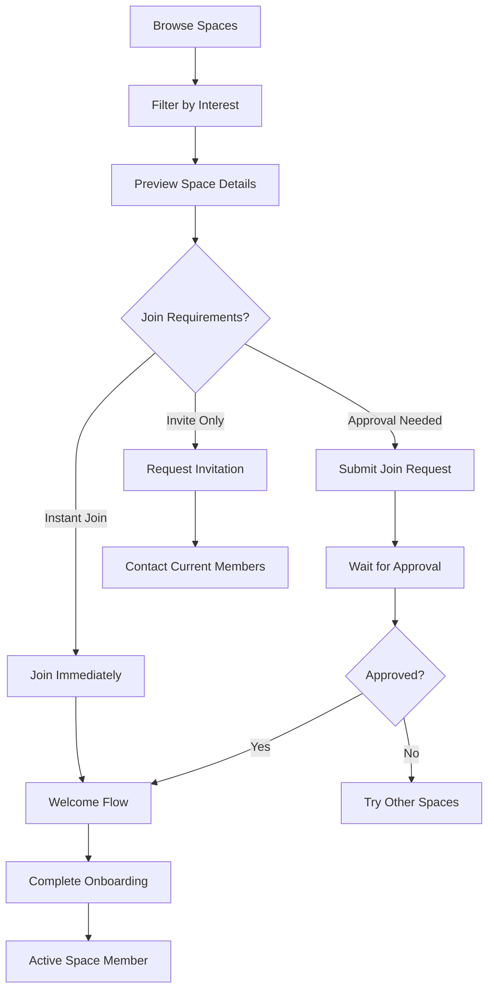
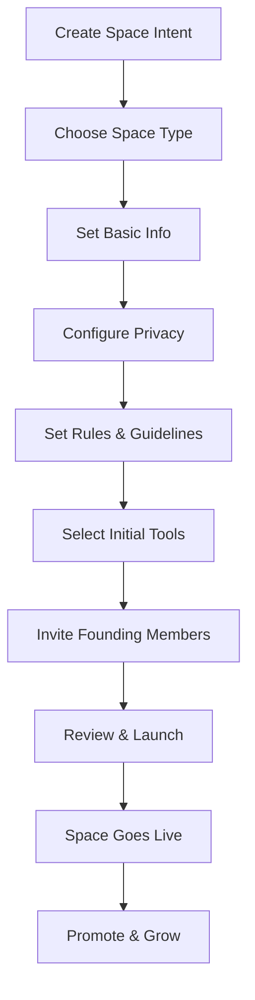
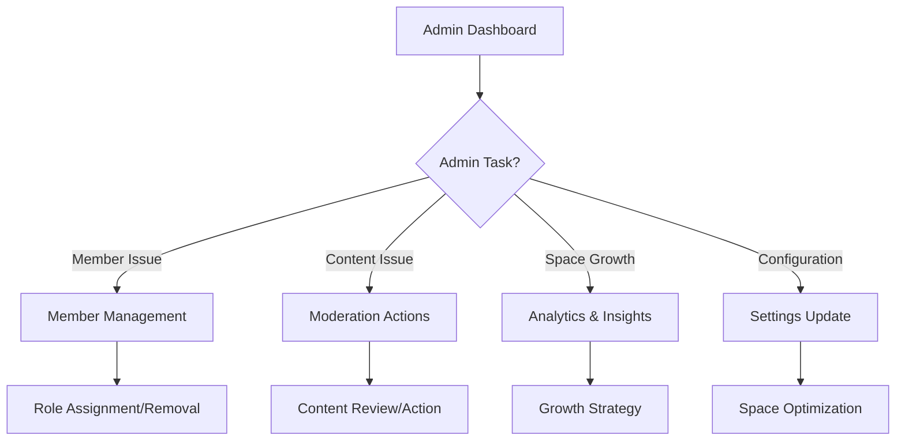

# HIVE Spaces Information Architecture

## 🏗️ **Spaces System Overview**

Spaces are **functional communities** where students organize around shared purposes - from academic study groups to residential floors to professional clubs. Each Space serves as a **coordination hub** with integrated tools, events, and communication.

---

## 📋 **Complete Page Structure**

### **🌟 Core Space Pages**

#### `/spaces` - **Space Discovery Hub**
- **Purpose**: Browse, search, and discover spaces to join
- **Key Features**:
  - Smart discovery filters (academic, residential, professional, recreational)
  - Trending spaces and recommended joins
  - Space preview cards with member count, activity level
  - Join requests and instant join options
  - Personal space recommendations based on profile

#### `/spaces/create` - **Space Creation Wizard**
- **Purpose**: Multi-step guided space creation
- **Flow**: Type → Details → Rules → Tools → Members → Launch
- **Key Features**:
  - Space type selection (Academic, Residential, Professional, Club, Project)
  - Customizable space identity (name, description, avatar, banner)
  - Privacy and membership settings
  - Rule and guideline setup
  - Initial tool and event integration
  - Founding member invitations

#### `/spaces/[spaceId]` - **Space Dashboard**
- **Purpose**: Main space activity and coordination center
- **Key Features**:
  - Activity feed with posts, events, tool usage
  - Quick actions (create event, use tool, post update)
  - Member highlights and recent activity
  - Upcoming events and deadlines
  - Space-specific tool shortcuts
  - Announcements and pinned content

### **🛠️ Space Management Pages**

#### `/spaces/[spaceId]/admin` - **Space Administration**
- **Purpose**: Comprehensive space management for admins/moderators
- **Key Features**:
  - Member management (roles, permissions, removal)
  - Content moderation and reporting
  - Space analytics and insights
  - Rule and setting management
  - Integration management (tools, events, external services)
  - Space archive and deletion options

#### `/spaces/[spaceId]/settings` - **Space Configuration**
- **Purpose**: Space settings and customization
- **Key Features**:
  - Basic info editing (name, description, avatar)
  - Privacy and visibility settings
  - Membership rules and approval processes
  - Notification preferences
  - Integration toggles
  - Branding and customization options

#### `/spaces/[spaceId]/members` - **Member Directory**
- **Purpose**: Space member management and networking
- **Key Features**:
  - Searchable member directory
  - Member roles and badges
  - Activity and contribution tracking
  - Direct messaging and networking
  - Member onboarding status
  - Alumni and inactive member management

#### `/spaces/[spaceId]/events` - **Space Event Hub**
- **Purpose**: Space-specific event management
- **Key Features**:
  - Space event calendar
  - Event creation and management
  - RSVP tracking and waitlists
  - Recurring event templates
  - Event analytics and feedback
  - Cross-space event coordination

#### `/spaces/[spaceId]/tools` - **Space Tool Library**
- **Purpose**: Curated tools for space activities
- **Key Features**:
  - Space-specific tool collections
  - Tool usage analytics and recommendations
  - Custom tool creation for space needs
  - Tool sharing and collaboration
  - Integration with space events
  - Tool permission management

### **🔍 Discovery & Networking Pages**

#### `/spaces/browse` - **Advanced Space Browser**
- **Purpose**: Detailed space exploration with filters
- **Key Features**:
  - Advanced filtering (size, activity, type, school)
  - Space comparison tools
  - Featured and recommended spaces
  - New space notifications
  - Space request and suggestion system

#### `/spaces/my-spaces` - **Personal Space Management**
- **Purpose**: Dashboard for all user's spaces
- **Key Features**:
  - Active spaces overview
  - Cross-space activity feed
  - Space-specific notifications
  - Quick space switching
  - Space creation shortcuts
  - Membership renewal and leaving options

---

## 🎯 **User Flows & Journeys**

### **Flow 1: Discovering and Joining a Space**

### **Flow 2: Creating a New Space**

### **Flow 3: Space Administration**

---

## 🧩 **Component Architecture**

### **🎨 Space UI Components**

#### **Molecules**
- `SpaceCard` - Compact space preview with join action
- `SpaceMemberCard` - Member profile with role and activity
- `SpaceActivityItem` - Individual activity feed item
- `SpaceEventCard` - Space-specific event display
- `SpaceToolCard` - Tool preview with usage stats
- `SpaceStatsWidget` - Key metrics display
- `SpaceInviteCard` - Invitation management
- `SpaceAnnouncementBanner` - Important space updates

#### **Organisms**
- `SpaceHeader` - Space identity, stats, and actions
- `SpaceActivityFeed` - Chronological space activities
- `SpaceMemberDirectory` - Searchable member list
- `SpaceEventCalendar` - Space event scheduling
- `SpaceToolLibrary` - Available tools for space
- `SpaceAdminPanel` - Administrative controls
- `SpaceDiscoveryGrid` - Browse and search interface
- `SpaceOnboardingFlow` - New member welcome

#### **Templates**
- `SpaceDashboardLayout` - Main space page structure
- `SpaceManagementLayout` - Admin page structure
- `SpaceDiscoveryLayout` - Browse page structure
- `SpaceSettingsLayout` - Configuration page structure

### **🔧 Key Modals**

#### **Space Management Modals**
- `CreateSpaceModal` - Quick space creation
- `SpaceSettingsModal` - Basic space configuration
- `SpaceMemberModal` - Member role and permission management
- `SpaceInviteModal` - Invitation creation and management
- `SpaceRulesModal` - Community guidelines editor
- `SpaceAnalyticsModal` - Space performance insights

#### **Member Interaction Modals**
- `JoinSpaceModal` - Space joining workflow
- `LeaveSpaceModal` - Departure confirmation and process
- `ReportContentModal` - Content flagging and reporting
- `MemberConnectionModal` - Networking within space
- `SpaceNotificationModal` - Notification preferences

#### **Content Creation Modals**
- `CreateSpaceEventModal` - Space-specific event creation
- `SpaceAnnouncementModal` - Important space communications
- `SpacePostModal` - Rich content creation for space feed
- `SpaceToolRequestModal` - Request tools for space use

---

## 🎭 **Space Types & Templates**

### **Academic Spaces**
- **Study Groups**: Course-specific collaboration
- **Research Teams**: Project-based research coordination
- **Tutoring Circles**: Peer learning and support
- **Thesis Groups**: Graduate student collaboration

**Features**: Study scheduling, resource sharing, progress tracking, academic calendar integration

### **Residential Spaces**  
- **Dorm Floors**: Floor-based community coordination
- **Building Communities**: Cross-floor residential engagement
- **Roommate Groups**: Living situation coordination
- **Housing Committees**: Residential governance

**Features**: Room coordination, floor events, maintenance requests, quiet hours scheduling

### **Professional Spaces**
- **Career Clubs**: Industry-specific networking
- **Entrepreneurship Groups**: Startup and business development
- **Internship Networks**: Professional opportunity sharing
- **Alumni Connections**: Networking with graduates

**Features**: Job sharing, networking events, mentorship matching, professional development

### **Recreational Spaces**
- **Hobby Groups**: Interest-based communities
- **Sports Teams**: Athletic coordination and scheduling
- **Gaming Communities**: Gaming events and tournaments
- **Cultural Organizations**: Cultural celebration and preservation

**Features**: Event coordination, resource booking, tournament brackets, cultural calendars

### **Project Spaces**
- **Hackathon Teams**: Competition-focused collaboration
- **Student Organizations**: Formal org management
- **Volunteer Groups**: Service project coordination
- **Creative Collectives**: Artistic collaboration

**Features**: Project management, deadline tracking, resource allocation, outcome sharing

---

## 🚀 **Space Lifecycle Management**

### **Space Creation Process**
1. **Type Selection**: Choose from predefined space types
2. **Identity Setup**: Name, description, visual branding
3. **Privacy Configuration**: Public, private, or invite-only
4. **Rule Establishment**: Community guidelines and expectations
5. **Tool Integration**: Select relevant tools for space activities
6. **Founding Members**: Invite initial community members
7. **Launch & Promotion**: Go live and attract new members

### **Space Growth Phases**
1. **Foundation** (1-10 members): Establishing core community
2. **Growth** (10-50 members): Active member recruitment
3. **Maturity** (50+ members): Established community with subgroups
4. **Evolution**: Specialization or spawning of sub-communities

### **Space Governance Models**
- **Democratic**: Member voting on major decisions
- **Administrative**: Designated admin/moderator control
- **Hierarchical**: Multiple role levels with different permissions
- **Collaborative**: Shared responsibility and rotating leadership

---

## 📊 **Space Analytics & Insights**

### **Member Engagement Metrics**
- Active members vs. total members
- Post and comment activity
- Event attendance rates
- Tool usage frequency
- Member retention and churn

### **Content Performance**
- Most engaging posts and discussions
- Popular tools and features
- Successful event formats
- Knowledge sharing effectiveness

### **Community Health Indicators**
- Member satisfaction scores
- Conflict resolution success
- Rule compliance rates
- New member onboarding success
- Cross-member connections formed

---

## 🔗 **Integration Points**

### **Event System Integration**
- Space-specific event creation
- Member RSVP management
- Event promotion within space
- Recurring space events
- Cross-space event coordination

### **Tool System Integration**
- Space-curated tool libraries
- Usage analytics and recommendations
- Custom tool development for space needs
- Tool permissions and sharing
- Integration with space events and activities

### **Profile System Integration**
- Space membership display on profiles
- Role and contribution highlighting
- Cross-space networking
- Achievement and recognition systems
- Privacy controls for space visibility

### **Feed System Integration**  
- Space-specific content feeds
- Cross-space content discovery
- Trending topics within spaces
- Member-generated content promotion
- Activity summarization and highlights

---

This architecture creates **functional communities** that serve as coordination hubs for every aspect of campus life, from academic collaboration to residential coordination to professional networking. Each space becomes a **social utility** where connections form around solving real problems together.

**Next Step**: Begin implementation with the Space Creation Wizard and Space Dashboard components.