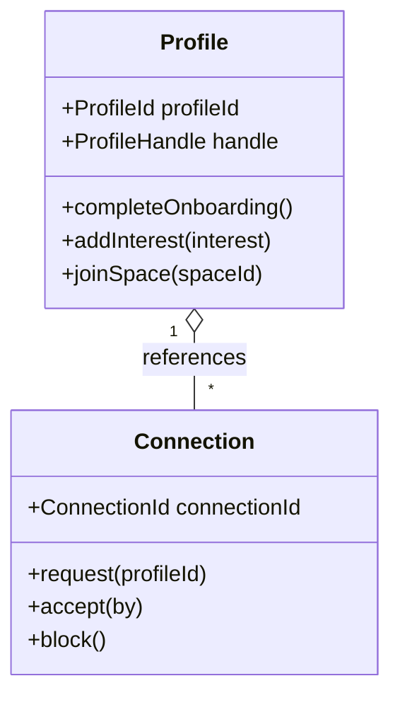
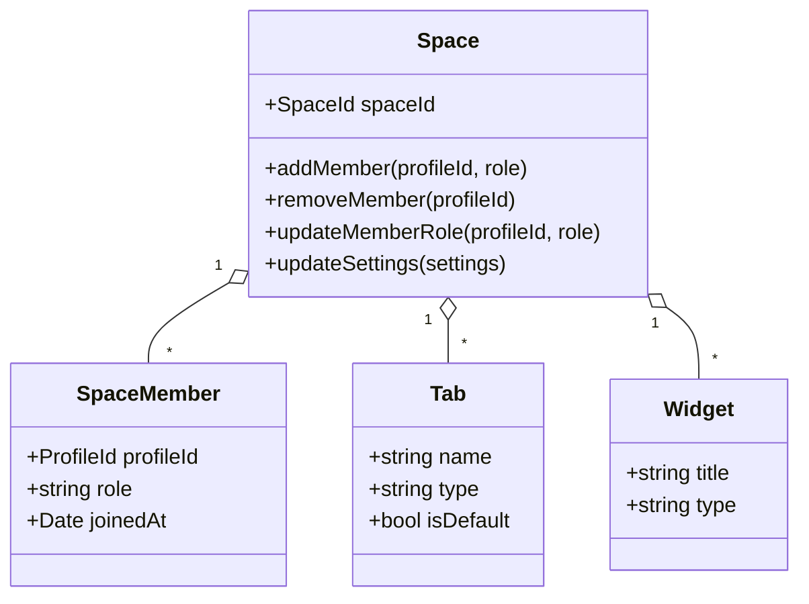
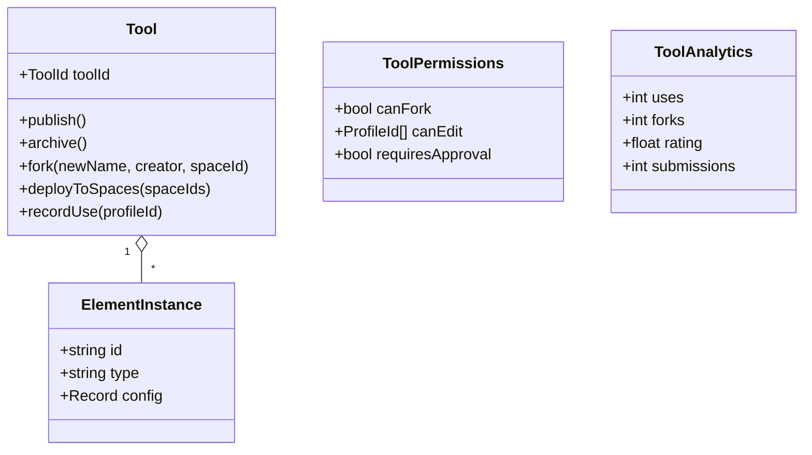
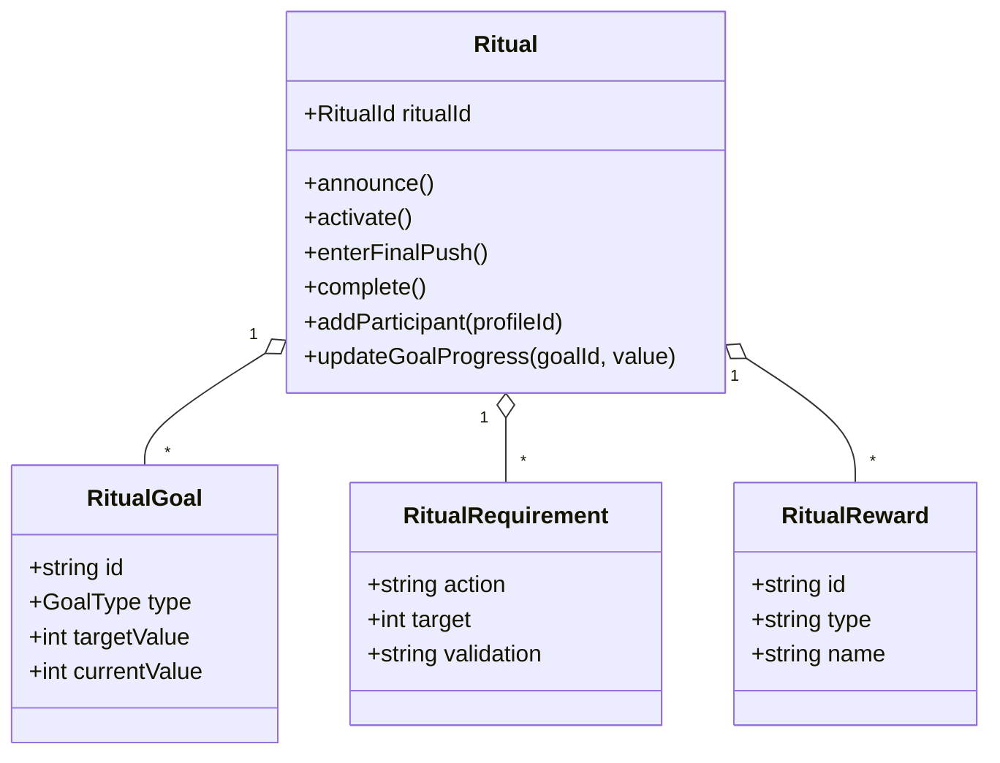
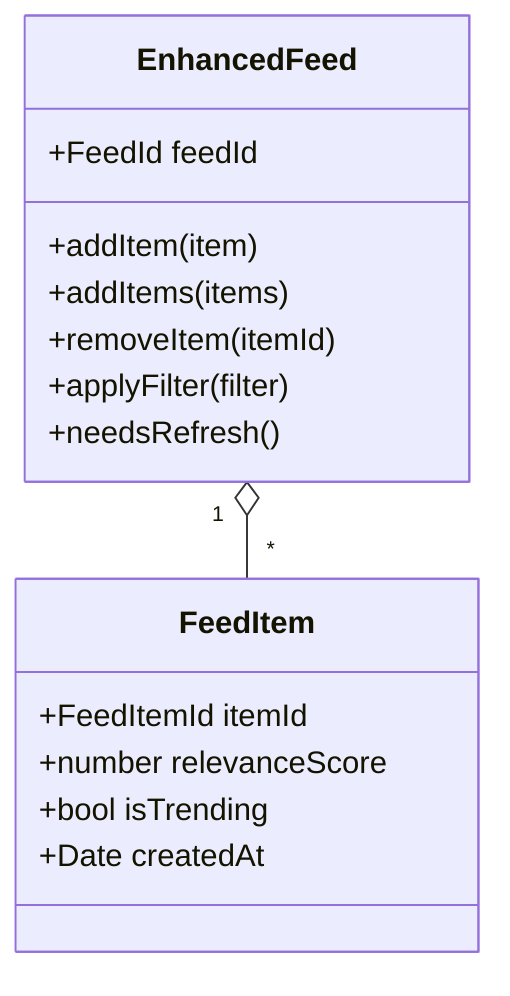

# HIVE DDD Current State Audit
**Date:** October 4, 2025
**Purpose:** Capture the behavior of the refactored aggregates before the next wave of feature work
**Status:** 🟡 Healthy core models with notable guard-rail gaps

---

## 📊 Executive Summary
- ✅ Aggregates now exist for every active slice (Profile, Spaces, Tools, Rituals, Feed) with richer domain events.
- ✅ Value objects cover ids, handles, space metadata, ritual classifications, and tool configuration.
- ⚠️ Campus isolation and visibility rules are inconsistently enforced across aggregates.
- ⚠️ A number of "setters" still bypass invariants for repository convenience; they are hotspots for future refactors.
- ❌ Feed aggregate lacks domain events and still leans on `any` shapes for algorithm data.

---

## 🏗️ Domain Inventory (2025-10-04)

| Domain | Aggregates | Key Entities / VOs | Domain Events | Health |
|--------|------------|--------------------|---------------|--------|
| **Profile** | `Profile`, `Connection` | `PersonalInfo`, `AcademicInfo`, `SocialInfo`, `ProfilePrivacy`, `ProfileId`, `ConnectionId` | `ProfileCreated`, `ProfileOnboarded` | 🟡 Strong identity core, connection aggregate still questionable |
| **Spaces** | `Space` | `SpaceMember`, `Tab`, `Widget`, `SpaceSettings`, `SpaceId`, `SpaceCategory` | `SpaceCreated`, `MemberJoined`, `MemberRemoved`, `MemberRoleUpdated`, `PostCreated` | 🟡 Rich membership logic, missing campus & capacity guards |
| **Tools** | `Tool` | `ElementInstance`, `ToolPermissions`, `ToolAnalytics`, `ToolId` | `ToolCreated`, `ToolPublished`, `ToolArchived`, `ToolForked`, `ToolDeployed`, `ToolUsed` | 🟡 Lifecycle modeled, deployment rules loose |
| **Rituals** | `Ritual` | `RitualGoal`, `RitualRequirement`, `RitualReward`, `ParticipationStats`, `RitualId` | `RitualCreated`, `RitualActivated`, `RitualDeactivated`, `ParticipantJoined`, `ParticipantLeft`, `MilestoneCompleted` | 🟡 Detailed progress logic, participation guards incomplete |
| **Feed** | `EnhancedFeed` | `FeedItem`, `FeedFilter`, `FeedId`, `ProfileId`, `CampusId` | *(none yet)* | 🔴 Behavior captured but still anemic and event-less |

---

## 👤 Profile Domain (`packages/core/src/domain/profile`)

**Ubiquitous Language**
- *Profile*: the canonical campus identity (`ProfileId`, `UBEmail`, `ProfileHandle`).
- *PersonalInfo / AcademicInfo / SocialInfo*: structured profile facets exposed to onboarding flows.
- *Connections*: symmetric or asymmetric relationships represented by the `Connection` aggregate.

**Enforced Invariants**
- `Profile.create` seeds default privacy, user type, and campus values when omitted.
- `completeOnboarding` refuses to run twice and requires academic info (intended for students).
- `addInterest` blocks duplicates and caps the list at 10 entries.
- `addConnection` / `removeConnection` keep counts synchronized with the stored array.

**Notable Domain Events**
- `ProfileCreatedEvent` on aggregate construction.
- `ProfileOnboardedEvent` after the onboarding flow succeeds.

**Gaps & Risks**
- 🟠 `completeOnboarding` requires academic info even for non-student `userType` values.
- 🟠 `joinSpace` and `addConnection` accept raw ids without enforcing campus isolation.
- 🟠 Several `set*` helpers bypass invariants for repository hydration—risk of inconsistent states.

**Domain Story – Transfer Student Onboards**
1. Given a transfer student with verified UB email, when they create a profile they receive default privacy and empty social info.
2. When they submit onboarding with major, interests, and starter spaces, the profile flips `isOnboarded=true` and emits `ProfileOnboardedEvent`.
3. Then they add interests until the limit and join dorm spaces, keeping connection counts in sync.

---

## 🏠 Spaces Domain (`packages/core/src/domain/spaces`)

**Ubiquitous Language**
- *Space*: student-run container scoped to a campus with members, tabs, widgets, and rush mode toggles.
- *SpaceMember*: link between a profile and a space with role (`admin | moderator | member`) and `joinedAt` timestamp.
- *Tabs & Widgets*: reorderable content scaffolding inside a space.

**Enforced Invariants**
- Creator automatically becomes the first `admin` member and bootstraps the "Feed" tab.
- `addMember` prevents duplicates and respects `maxMembers` when provided.
- `removeMember` & `updateMemberRole` protect the last admin from removal or demotion.
- `addTab` disallows duplicate tab names.

**Notable Domain Events**
- `SpaceCreatedEvent` at creation.
- `MemberJoinedEvent`, `MemberRemovedEvent`, `MemberRoleUpdatedEvent`, `PostCreatedEvent` to reflect key interactions.

**Gaps & Risks**
- 🟠 Campus isolation is implied via `campusId` but never validated when members join.
- 🟠 `updateSettings` may set `maxMembers` below the current count without reconciliation.
- 🟠 Widget addition lacks duplication / quota checks; RSS and rush-mode invariants are not enforced.

**Domain Story – Dorm Space Fills Up**
1. Given a dorm leader creates "Richmond 7th Floor" space, they become the initial admin and a Feed tab appears.
2. When friends join, the aggregate fires `MemberJoinedEvent` and bumps timestamps.
3. When the leader sets a member cap at 25 and the 26th student attempts to join, `addMember` rejects the request.
4. When a moderator tries to demote the last admin, the aggregate blocks it to preserve governance.

---

## 🛠️ Tools Domain (`packages/core/src/domain/tools`)

**Ubiquitous Language**
- *Tool*: HiveLab artifact configurable by space leaders, versioned and deployable across spaces.
- *ElementInstance*: visual-builder component with configuration, coordinates, and wiring details.
- *ToolPermissions*: governs forking, edit access, and submission approval.
- *ToolAnalytics*: usage counters (uses, forks, rating, submissions).

**Enforced Invariants**
- `Tool.create` requires name, description, at least one element, and seeds analytics counters.
- `publish` only succeeds from `draft` status with at least one element, stamping `publishedAt`.
- `fork` demands the source tool be published and forkable; increments `analytics.forks`.
- `deployToSpaces` / `recordUse` require the tool to be `published`.
- `updateElements` blocks changes to published tools and enforces at least one element.
- `grantEditAccess` prevents duplicates; `revokeEditAccess` forbids removing the creator.

**Notable Domain Events**
- `ToolCreatedEvent`, `ToolPublishedEvent`, `ToolArchivedEvent`, `ToolForkedEvent`, `ToolDeployedEvent`, `ToolUsedEvent` cover the key lifecycle moments.

**Gaps & Risks**
- 🟠 `updateVisibility` does not guard against making a `draft` tool public.
- 🟠 Deployment skips campus checks and does not emit an event on undeploy.
- 🟠 `permissions.canEdit` must be seeded by callers; aggregate does not guarantee the creator stays included.

**Domain Story – Study Buddy Timer Rolls Out**
1. Given a space leader assembles a timer tool with form inputs and actions, `Tool.create` validates the structure and raises `ToolCreatedEvent`.
2. When they publish the tool, status flips to `published`, `publishedAt` is stamped, and collaborators can now fork it if permitted.
3. When the leader deploys to multiple study spaces, `ToolDeployedEvent` captures target ids and the aggregate tracks deployments.
4. As students use the timer, `recordUse` increments analytics and emits `ToolUsedEvent` for downstream dashboards.

---

## 🔁 Rituals Domain (`packages/core/src/domain/rituals`)

**Ubiquitous Language**
- *Ritual*: campus-wide campaign typed as `short`, `anticipatory`, or `yearbook` with set durations.
- *RitualGoal*: quantifiable milestone with target and progress tracking.
- *RitualRequirement*: required action (e.g., join spaces) with validation mode.
- *RitualReward*: prize or recognition tied to completion.
- *ParticipationStats*: aggregate counters for total, active, completed participants.

**Enforced Invariants**
- `Ritual.create` validates name, description, ritual type, and duration combinations.
- `announce` only executes from `draft`; `activate` only from `announced` or `paused`.
- `enterFinalPush`, `complete`, and `pause` enforce lifecycle ordering.
- `addParticipant` prevents duplicates, respects optional capacity, and blocks joins on hidden rituals.
- `updateGoalProgress` flips `isCompleted` when target is met and emits `MilestoneCompletedEvent`.

**Notable Domain Events**
- `RitualCreatedEvent`, `RitualActivatedEvent`, `RitualDeactivatedEvent`, `ParticipantJoinedEvent`, `ParticipantLeftEvent`, `MilestoneCompletedEvent`.

**Gaps & Risks**
- 🟠 `addParticipant` does not check ritual status—students can join drafts.
- 🟠 Removing a participant reduces `active` but not `total`, skewing stats.
- 🟠 Goal progress accepts any numeric `progress` without clamping or validation against regressions.

**Domain Story – Yearbook Clash**
1. Given campus ops schedules a `yearbook` ritual for three weeks, `Ritual.create` seeds goals, requirements, and participation stats.
2. When the ritual is announced and later activated, events broadcast the transitions.
3. As students join, capacity is enforced and `ParticipantJoinedEvent` tracks enrollment.
4. When goals are met, the ritual fires `MilestoneCompletedEvent` and `getParticipationWarnings` signals ending soon, guiding push messaging.

---

## 📰 Feed Domain (`packages/core/src/domain/feed`)

**Ubiquitous Language**
- *EnhancedFeed*: per-profile aggregate containing ordered `FeedItem`s, filters, and refresh cadence.
- *FeedItem*: polymorphic content (space posts, rituals, events) with `relevanceScore`, `isTrending`, and metadata.
- *FeedFilter*: lightweight toggles such as `all`, `spaces`, `rituals`, `events`, `trending`.

**Enforced Invariants**
- Maximum of 100 items; older items are pruned when new ones arrive.
- Duplicate items (via `itemId`) are rejected.
- `needsRefresh` enforces a 30-second minimum between refreshes.
- Filter operations deduplicate filter types and default back to `all`.

**Gaps & Risks**
- 🔴 No domain events—downstream systems cannot react to feed recomposition.
- 🔴 Heavy reliance on `any` for algorithm data; `applyContentFilters` inspects loosely-typed payloads.
- 🟠 Insights and weight adjustment logic expect `item.toData()` but do not guard when absent.

**Domain Story – Catching Up Between Classes**
1. Given a commuter opens the app after lecture, their `EnhancedFeed` already contains the last 100 relevant items scoped to UB.
2. When new space posts arrive, `addItems` merges them, prunes old content, and reorders by pin/relevance/recency.
3. When the student toggles to ritual highlights, `applyFilter({ type: 'rituals' })` trims to ritual content while preserving timestamps.
4. After heavy scrolling, `needsRefresh` flips true, letting the UI request a refresh.

---

## ✅ Next Steps
- Align campus isolation checks across Profile, Space, and Tool aggregates.
- Replace repository hydration setters with factory/adapters that preserve invariants.
- Introduce domain events (and handlers) for feed mutations.
- Add acceptance tests that cover the domain stories above to serve as regression safety nets.
