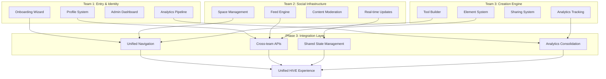

# 🚀 PHASE 3: TEAM INTEGRATION PLAN

## Integration Overview

Phase 3 systematically integrates the three completed team workstreams into a unified HIVE vBETA experience. Each team has built production-ready components with clear integration points that now need to be connected.

### Team Status Summary
- **Team 1 (Entry & Identity)**: ✅ Complete - 47/47 tasks delivered
- **Team 2 (Social Infrastructure)**: ✅ Complete - 38/38 tasks delivered  
- **Team 3 (Creation Engine)**: ✅ Complete - 42/42 tasks delivered

## Integration Architecture

## Integration Tasks

### I1: Navigation & Layout Integration
**Goal**: Create a unified navigation experience that seamlessly connects all three teams' features.

#### I1-01: Unified App Shell
- [ ] Create main app layout with integrated navigation
- [ ] Implement responsive sidebar with Team 1/2/3 sections
- [ ] Add breadcrumb navigation for deep linking
- [ ] Integrate Team 1's profile header across all pages

#### I1-02: Cross-team Navigation
- [ ] Profile → My Spaces (Team 2) integration
- [ ] Profile → My Tools (Team 3) integration  
- [ ] Space Feed → Tool Sharing (Team 3) integration
- [ ] Tool Builder → Space Sharing (Team 2) integration

### I2: API Integration & Data Flow
**Goal**: Replace mock APIs with real cross-team data connections.

#### I2-01: Team 1 ↔ Team 2 Integration
- [ ] Replace Profile "My Spaces" mock with real Team 2 API
- [ ] Connect onboarding auto-join to Team 2 space system
- [ ] Integrate Team 1 user data in Team 2 feed posts
- [ ] Connect builder role to Team 2 space permissions

#### I2-02: Team 1 ↔ Team 3 Integration  
- [ ] Replace Profile "My Tools" mock with real Team 3 API
- [ ] Connect builder opt-in to Team 3 tool creation permissions
- [ ] Integrate Team 1 analytics with Team 3 creation events
- [ ] Connect user profiles to tool ownership

#### I2-03: Team 2 ↔ Team 3 Integration
- [ ] Implement Team 3 "toolshare" post type in Team 2 feed
- [ ] Connect tool sharing to space membership validation
- [ ] Integrate tool metadata in feed post display
- [ ] Enable tool discovery through space feeds

### I3: State Management Integration
**Goal**: Create unified state management for cross-team features.

#### I3-01: Shared State Architecture
- [ ] Implement unified user state (Team 1 + Team 2 + Team 3)
- [ ] Create shared space membership state
- [ ] Implement tool ownership and permissions state
- [ ] Add real-time synchronization across teams

#### I3-02: Cache Coordination
- [ ] Coordinate React Query cache keys across teams
- [ ] Implement cache invalidation for cross-team updates
- [ ] Add optimistic updates for cross-team operations
- [ ] Ensure data consistency across team boundaries

### I4: Analytics Consolidation
**Goal**: Unify analytics tracking across all three teams.

#### I4-01: Event Schema Unification
- [ ] Merge Team 1 onboarding events with Team 3 creation events
- [ ] Integrate Team 2 feed events with unified pipeline
- [ ] Create cross-team user journey tracking
- [ ] Implement funnel analysis across all teams

#### I4-02: Privacy & Compliance
- [ ] Ensure GDPR compliance across all team analytics
- [ ] Implement unified opt-out controls
- [ ] Add cross-team data anonymization
- [ ] Create unified privacy dashboard

### I5: Testing & Quality Assurance
**Goal**: Ensure integration reliability and prevent regressions.

#### I5-01: Integration Testing
- [ ] Create E2E tests for cross-team user flows
- [ ] Test onboarding → space joining → tool creation flow
- [ ] Verify tool sharing → feed posting → profile display
- [ ] Test admin dashboard with all team data

#### I5-02: Performance Testing
- [ ] Load test unified navigation performance
- [ ] Verify cross-team API response times
- [ ] Test real-time updates across team boundaries
- [ ] Ensure mobile performance with full integration

## Integration Priorities

### Phase 3A: Core Connections (Week 1)
**Priority**: Critical user flows that enable basic cross-team functionality

1. **I1-01**: Unified App Shell - Navigation foundation
2. **I2-01**: Team 1 ↔ Team 2 - Profile spaces integration
3. **I2-02**: Team 1 ↔ Team 3 - Profile tools integration
4. **I3-01**: Shared State Architecture - Foundation

### Phase 3B: Advanced Features (Week 2)  
**Priority**: Enhanced features that create seamless user experience

1. **I2-03**: Team 2 ↔ Team 3 - Tool sharing in feeds
2. **I1-02**: Cross-team Navigation - Deep linking
3. **I3-02**: Cache Coordination - Performance optimization
4. **I4-01**: Analytics Consolidation - Unified tracking

### Phase 3C: Polish & Testing (Week 3)
**Priority**: Quality assurance and launch preparation

1. **I5-01**: Integration Testing - E2E coverage
2. **I5-02**: Performance Testing - Load testing
3. **I4-02**: Privacy & Compliance - Final compliance check
4. **Launch Preparation**: Final integration verification

## Success Metrics

### Technical Metrics
- **API Response Times**: <500ms for all cross-team calls
- **Navigation Performance**: <200ms page transitions
- **Real-time Sync**: <1s cross-team update propagation
- **Cache Hit Rate**: >80% for frequently accessed cross-team data

### User Experience Metrics
- **Cross-team Flow Completion**: >85% users complete onboarding → space → tool flow
- **Navigation Efficiency**: <3 clicks to reach any major feature
- **Data Consistency**: 0 cross-team data sync errors
- **Mobile Performance**: <3s full app load time

### Business Metrics
- **Feature Adoption**: >60% users engage with features from all 3 teams
- **Tool Sharing**: >40% tools shared to spaces within 24h of creation
- **Space Engagement**: >70% users active in auto-joined spaces
- **Builder Conversion**: >25% builder opt-ins create tools within 7 days

## Risk Mitigation

### Technical Risks
- **API Latency**: Implement aggressive caching and optimistic updates
- **State Conflicts**: Use atomic transactions and conflict resolution
- **Real-time Sync**: Graceful degradation for connection issues
- **Mobile Performance**: Progressive loading and code splitting

### User Experience Risks
- **Navigation Confusion**: Clear visual hierarchy and breadcrumbs
- **Feature Overload**: Progressive disclosure and onboarding hints
- **Cross-team Inconsistency**: Unified design system enforcement
- **Performance Degradation**: Continuous monitoring and optimization

## Launch Readiness Checklist

### Core Integration ✅
- [ ] All three teams' features accessible through unified navigation
- [ ] Cross-team APIs replace all mock implementations
- [ ] Real-time updates work across team boundaries
- [ ] Shared state management handles all cross-team scenarios

### User Experience ✅
- [ ] Seamless user flows from onboarding through tool creation
- [ ] Consistent design language across all team features
- [ ] Mobile-responsive experience for all integrated features
- [ ] Accessibility compliance maintained across integration

### Performance ✅
- [ ] Sub-3s full app load time on mobile
- [ ] Sub-500ms API response times for all operations
- [ ] Efficient caching prevents unnecessary re-fetches
- [ ] Real-time updates don't impact performance

### Analytics & Compliance ✅
- [ ] Unified analytics pipeline captures all user interactions
- [ ] GDPR/CCPA compliance maintained across all features
- [ ] Privacy controls work consistently across teams
- [ ] Admin dashboard provides complete cross-team visibility

---

**Phase 3 will deliver a unified HIVE vBETA experience that seamlessly integrates all three team workstreams into a cohesive, production-ready social platform for campus communities.** 