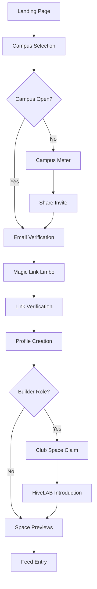
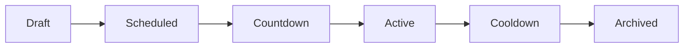

# HIVE Product Narrative Overview — The Complete User Experience Bible

**Rev Gold-300** | **vBETA Era** | **No Code, Pure UX Narrative**

> **This doc is a scene-by-scene storyboard.** Every screen lists ➊ purpose, ➋ composition, ➌ hero micro-interactions, and ➍ edge states—so design can mock without questions and dev can wire without guesswork.

---

## 🎯 **EXECUTIVE MISSION STATEMENT**

HIVE creates authentic campus communities through intelligent spaces and creator tools, enabling students to build meaningful connections and valuable collaborative experiences that transcend traditional social media paradigms.

**Summer vBETA Strategy**: Creator cultivation period with emphasis on tool building and ritual experimentation, preparing for full-scale community activation in Fall.

---

## 🔑 **BRAND FLASHCARD** _(Keep Pinned)_

| Element            | Specification                            |
| ------------------ | ---------------------------------------- |
| **Canvas**         | `#0A0A0A` (matte black)                  |
| **Gold Accent**    | `#FFD700` (primary highlight)            |
| **Motion Grammar** | 200ms ease-out, never elastic            |
| **Copy Tone**      | Confident whisper                        |
| **Footer Credo**   | "Built by Students · Owned by Students." |

---

## 📖 **TABLE OF CONTENTS**

1. [**HIVE Entry & Identity System**](#entry-identity) — Cold open to community belonging
2. [**HIVE Feed — Campus Heartbeat**](#feed-system) — Living activity stream and discovery engine
3. [**HIVE Spaces — Community Clubhouses**](#spaces-system) — Group hubs with tools and content
4. [**HiveLAB — Creator Forge**](#hivelab-system) — Low-code tool building platform
5. [**Tools Kernel & Rituals Engine**](#tools-rituals) — Platform mechanics and engagement systems

---

## 🚪 **HIVE ENTRY & IDENTITY SYSTEM** {#entry-identity}

_Screen-by-Screen Flow Bible for User Acquisition & Onboarding_

### **Macro Flow Overview**



### **Screen-by-Screen Canon**

#### **2.1 Landing — "Get Inside"**

**Purpose**: Cold open brand reveal, zero nav chrome—focus on CTA.

**Layout DNA**:

- Full-bleed `#0A0A0A` background
- Center `<HeroButton>` 56px height, pill shape, gold border 2px
- Small crest watermark 8% opacity bottom-right

**Copy Blocks**:

- Button: `"Get Inside"`
- Footer: `"Built by Students · Owned by Students."`

**Hero Motion**:

- Hover → gold glow (`drop-shadow: 0 0 8px #FFD700`, opacity 0.3→0.6)
- Click → screen fades to black 120ms then slides campus-select up

**Edge States**: None (single action surface)

---

#### **2.2 Campus Select — Territory Claim**

**Purpose**: Anchor user to a campus context.

**Layout DNA**:

- Top bar 48px with back chevron
- `<Typeahead>` full width, 20px radius, gold caret
- Results list: crest left, campus name, gold pulse highlight on active row

**Copy Blocks**:

- Headline: `"Where do you study?"`
- Empty state: `"We'll plant a flag if you can't find it."`

**Hero Motion**:

- Selecting a campus → crest scales 1 → 1.2 → 1 with gold stroke flash

**Edge States**:

- Unlisted campus: route to plant-flag flow

---

#### **2.3 Threshold Pending — Campus Meter (<300)**

**Purpose**: Rally users when campus hasn't unlocked.

**Layout DNA**:

- Center `<ProgressRing>` (180px) with gold stroke tracking verified count
- Below: gold count text `"{{remaining}} students left to open..."`
- Share button gold outline

**Copy Blocks**:

- Headline: `"Almost there!"`
- Share CTA: `"Rally your crew"`

**Hero Motion**:

- Progress ring animates remaining delta on realtime updates
- Share button pulse every 10s

**Edge States**:

- If user is last to hit 300 → ring shatters (gold particles) and immediate redirect to email-input

---

#### **2.4 Share Invite — Viral Nudge**

**Purpose**: Provide frictionless invite mechanism.

**Layout DNA**:

- Modal on matte backdrop
- Copy link field + copy icon
- QR code secondary tab

**Copy Blocks**:
`"Copy and drop this anywhere. Every new join cracks the gate faster."`

**Hero Motion**:

- Copy icon tick → link field flashes gold 300ms

**Edge States**:

- Clipboard blocked → fallback toast `"Link copied, probably."` (tongue-in-cheek)

---

#### **2.5 Email Input — Secret Handshake**

**Purpose**: Accept \*.edu email proof.

**Layout DNA**:

- Single embossed `<TextField>` 420px width
- Gold key icon inside field right
- Error microtext below

**Copy Blocks**:

- Headline: `"Prove you belong."`
- Placeholder: `"you@campus.edu"`

**Hero Motion**:

- Submit → key icon spins 360° while sending magic link

**Edge States**:

- Typo Suggestion: dropdown `"Did you mean buffalo.edu?"`
- Non-edu: toast `"We only trust .edu—for now."`

---

#### **2.6 Limbo Lounge — Suspense Reel**

**Purpose**: Entertain during inbox hop; keeps session warm.

**Layout DNA**:

- Full-screen duotone video loop (late-night dorm life)
- Center spinner – gold dots
- `"Check your inbox"` text

**Copy Blocks**:

- Headline: `"We're jiggling the lock..."`

**Hero Motion**:

- Video brightness ramps 80% → 100% over 8s, loops

**Edge States**:

- `"Didn't get email?"` link reveals OTP fallback field

---

#### **2.7 Verification — Magic Door**

**Purpose**: Transition back after magic link/OTP.

**Layout DNA**:

- Gold ripple background animation 600ms
- Large gold key rotates into lock graphic

**Copy Blocks**:
`"Door unlocked."`

**Hero Motion**:

- Ripple expands, then fade to pledge-card

**Edge States**:

- Expired link: route to limbo-lounge with banner `"Link timed out. Try again."`

---

#### **2.8 Pledge Card — Minimal Profile Seed**

**Purpose**: Capture name + grad year (and optional dorm/major).

**Layout DNA**:

- Card 380px, dark glass
- Two text inputs, grad year dropdown
- Optional dorm & major accordions
- Submit button gold fill

**Copy Blocks**:

- Headline: `"Almost in—stake your name."`

**Hero Motion**:

- Card lifts 4px on any input focus
- Submit → gold confetti burst

**Edge States**:

- Under-13: COPPA modal instead of confetti, blocks flow

---

#### **2.9 Builder Claim (Conditional) — Grab a Club Space**

**Purpose**: Let Builder own a pre-seeded UB club Space.

**Layout DNA**:

- Grid of space cards (crest, title, member count)
- Unclaimed show gold outline dashed

**Copy Blocks**:

- Headline: `"Which corner do you want to run?"`

**Hero Motion**:

- Click → card flips 3D to gold solid border, wrench icon appears

**Edge States**:

- All claimed: show waitlist banner `"More Labs opening soon."`

---

#### **2.10 Preview Spaces — Locked Tiles**

**Purpose**: Tease auto-joined '29, Major, Residential Spaces.

**Layout DNA**:

- Horizontal scroll list
- Tile 140 × 140px, greyed, padlock icon
- Countdown badge bottom-right

**Copy Blocks**:

- Tile Tooltip: `"Opens at Orientation"` or `"Opens after first Ritual post."`

**Hero Motion**:

- Hover → padlock jiggle 1°
- Countdown badge ticks every minute

**Edge States**:

- Major/dorm not set: prompt overlay `"Set your major to unlock faster."`

---

#### **2.11 Feed Overlay — Ritual Primer**

**Purpose**: Orient first-time user to Ritual timer once Feed loads.

**Layout DNA**:

- Transparent overlay dims feed 30%
- Gold spotlight around timer widget
- Dismiss button bottom-center

**Copy Blocks**:

- `"Storm starts in"` → dynamic countdown
- `"Tap to schedule your first post."`

**Hero Motion**:

- Spotlight pulse 0.5s
- Dismiss fades overlay

**Edge States**:

- Overlay auto-dismiss after 15s idle

---

### **Edge-Case Matrix**

| Trigger              | Screen Fallback         | Extra Copy                              |
| -------------------- | ----------------------- | --------------------------------------- |
| Campus <300          | threshold-pending       | `"200+ students left..."`               |
| Magic link expired   | limbo-lounge            | `"Link timed out. We'll send another."` |
| OTP fail-3           | In-modal Mascot CAPTCHA | `"Name our mascot."`                    |
| User under 13        | COPPA modal             | `"Ask a guardian..."`                   |
| Space unlock offline | Toast                   | `"Your '29 Space just opened—jump in!"` |

---

## 📺 **HIVE FEED — CAMPUS HEARTBEAT** {#feed-system}

_Narrative Flow Blueprint for vBETA Era Discovery Engine_

### **Why Feed Exists in vBETA**

1. **Single Front Door** — Only active surface on Day 0
2. **Hype Engine** — Announces campus unlock, orientation, ritual waves
3. **Ritual Theater** — Every ritual runs here and hints at features coming to Spaces & Builders in v1
4. **Loop Generator** — Each banner/post nudges to deeper action (claim Space, react, invite)
5. **Living Construction Site** — Feed visually evolves; students witness HIVE assemble in real time

**Design Principle**: If an idea doesn't serve at least one of those purposes, it stays out.

### **Feed Anatomy**

```
┌──────────────────────────────────────────┐
│  Top Strip  ← System Rail / Ritual Row   │  (Horizontal scroll)
├──────────────────────────────────────────┤
│  Main Feed  ← Campus Chatter & Events    │  (Vertical scroll)
└──────────────────────────────────────────┘
```

#### **Top Strip (System Rail)**

Lives above the fold. Horizontal swipe on mobile; full-width snap cards on desktop.

| Tile                       | Triggers                         | Visual Cue                          |
| -------------------------- | -------------------------------- | ----------------------------------- |
| **Unlock Banner**          | Campus hits 300                  | Gold confetti burst + `"Unlocked!"` |
| **Ritual Countdown**       | Any ritual ≤ 24h                 | Gold ring ticks every sec           |
| **Space Opening**          | '29 / Major / Residential unlock | Crest + `"Now Open"`                |
| **Tool Reveal**            | New tool used in Spaces          | Tool icon + `"Now live in Spaces"`  |
| **Builder Call**           | System needs a Builder           | Wrench glyph, pulse 8s              |
| **Orientation Quest Step** | Milestone hit                    | Check-mark tick, tiny confetti      |

**Note**: Tiles auto-expire after 24h unless ritual still active.

#### **Main Feed (Campus Chatter)**

| Source                                    | Inclusion Rule                     | Sorting                   | Extras                            |
| ----------------------------------------- | ---------------------------------- | ------------------------- | --------------------------------- |
| **UB Pre-Seeded Events**                  | Always visible Day 0+              | Sticky 48h                | Auto-collapses after event passes |
| **Space Posts** ('29, Major, Residential) | Only after respective unlock       | Recency then reactions    | Inline emoji reactions visible    |
| **Tool Posts**                            | Generated when new tool first used | Boosted top 3 for 24h     | Tag pill `"Powered by ___"`       |
| **Ritual Threads**                        | Auto-generated                     | Pinned during ritual      | Replies in thread view, not Feed  |
| **Builder Announcements**                 | From claimed Club Spaces           | Boosted if ≥ 10 reactions | Shrinks after 72h                 |

**Comment Strategy**: Comment composer is hidden—we tease it via inline `"💬 Comment"` button that deep-links into Space thread. Quick emoji tap reacts in-feed.

### **Event Density Strategy (700 Events Problem)**

- **Daily Bucket**: Show max 5 upcoming events per real-world day. Tap `"See X more events"` reveals modal list
- **Auto-Collapse Past**: Events older than 24h collapse to thin summary card (`"3 events finished yesterday ... Expand"`)
- **Smart Rotate**: If user scrolls past same event 3× in session, Feed hides it until page reload

**Goal**: Prevent "scrolling into the abyss" feeling after 1000px.

### **72-Hour Narrative Timeline**

- **Day 0** ▶ Campus Unlocked ▶ Orientation Countdown
- **Day 1** ▶ '29 Space Opens ▶ Orientation Q&A Thread ▶ First emoji reactions roll in
- **Day 2** ▶ Major & Residential Open ▶ Tool-powered Poll surfaces ▶ UB Events (RSS)
- **Day 3** ▶ Builder Call – `"Claim the Bracket Tool"` ▶ Tool reveal tile ▶ Feed auto-collapses Day 0 banners

**Rule**: Never leave Feed visually stagnant > 12h.

### **Interaction Rules**

- **Tap Top Strip tile** → deep-link (Space, ritual, tool docs)
- **Inline Emoji Tap** on any post → instantly increments reaction counter (👍 😂 🔥 🤔)
- **Long-press / Hover post** → menu (Share, Mute Space, Report)
- **Comment button** → deep-link to Space thread composer
- **Posts fade to 30% opacity** after 72h unless still gaining emoji reactions
- **Auto-collapse large event stack** after 5 visible events

### **Visual & Motion Guidelines**

- **Canvas**: `#0A0A0A` · **Gold**: `#FFD700` — Use color only for system events & reactions
- **Scroll**: Inertial; no snap pagination
- **Tiles**: Emboss; hover reveals inner shadow
- **Confetti & sparks**: Matte gold particles, max 700ms fade-out
- **Haptic**: Light tap on emoji reaction + Top Strip swipe

### **Edge-Case Handling**

| Scenario                        | Feed Reaction                                      |
| ------------------------------- | -------------------------------------------------- |
| Campus unlock while offline     | `"Campus Unlocked!"` tile persists 12h next login  |
| User major/dorm unset by Day 2  | Personal Top Strip tile prompts profile completion |
| Builder Claim List empty        | Tile: `"All clubs claimed – more dropping soon."`  |
| Post flagged sock-puppet        | Feed hides post; Space Mods alerted                |
| User scrolls past same event 3× | Event auto-collapses beneath `"Older events"`      |

---

## 🏛️ **HIVE SPACES — COMMUNITY CLUBHOUSES** {#spaces-system}

_Strategic Blueprint for Group Hubs and Builder Canvas_

### **Why Spaces Exist**

Feed is the stage; Spaces are the rehearsal rooms, clubhouses, and laboratories where students actually build culture.

1. **Belonging** — Smaller context = lower posting friction
2. **Builder Canvas** — Only place where tools live & evolve
3. **Growth Flywheel** — Healthy Spaces inject posts/events back to Feed, luring lurkers inside

**vBETA Twist**: Only auto-joined, pre-joined, or Builder-opened Spaces are visible. Directory drops post-summer.

### **Space Sections & Opening Rules**

| Section             | Creation Path                  | Who Can Open               | Visibility Logic                                                                                |
| ------------------- | ------------------------------ | -------------------------- | ----------------------------------------------------------------------------------------------- |
| **Residential**     | System seeds one per dorm      | System (opens prior to v1) | Auto-join if dorm set; preview locked if not                                                    |
| **Academics**       | System seeds one per major     | System (auto-opens)        | Auto-join if major set; uses Academic Tool from Profile                                         |
| **Student Orgs**    | Pre-seed list                  | Builder Owner              | Space remains preview-locked until Builder hits `"Open"`                                        |
| **Greek Life**      | Pre-seed list                  | Invite-only Officer        | Invite-only join; special Greek tools (points, roster)                                          |
| **University Orgs** | Admin seeded (faculty allowed) | Admin or Faculty Owner     | Can build in vBETA but stays preview-locked until v1 unless faculty flips `"Open early"` toggle |

**Note**: '29 Class Space is absorbed into Academics (year cohort = implicit major "Undeclared '29").

### **Core Space Anatomy**

```
┌───────────────────────────────┐
│ Header Bar                    │ (crest · name · member avatars · menu)
├───────────────────────────────┤
│ Tool Rail (max 5)             │ Join • Chat • Events • Tool4 • Tool5
├───────────────────────────────┤
│ Posts Feed (default focus)    │ Compact cards, emoji react inline
├───────────────────────────────┤
│ Events Pane (toggle slide-up) │ RSVP & event thread
└───────────────────────────────┘
```

**Tool Rail Details**:

- **Join, Chat, Events** = immutable system tools (count toward 5)
- **Builder can add up to 2 custom tools** in vBETA (Poll, Bracket, RSVP upgrade, etc.)
- **Tool Rail collapses into draggable drawer** on mobile

### **Builder Freedom vs Guardrails (vBETA)**

| Axis               | Decision                                        |
| ------------------ | ----------------------------------------------- |
| **Tool slots**     | 5 total per Space (3 system + 2 custom)         |
| **Layout editing** | Off — single-column feed; tool rail fixed order |
| **Theme colors**   | Off — inherit dark + gold                       |
| **Member cap**     | 2,000 soft; warn at 1,500                       |
| **Moderation**     | Owner & Mods. Shadow-ban, delete, slow-mode     |
| **Analytics**      | Basic: view+reaction counts, weekly digest DM   |

**"Go wild" = creative tool combos, not layout chaos.** v1 unlocks layout & theme editing.

### **Membership & Roles**

| Role          | Powers                                            | Auto-Assigned                                                                                  |
| ------------- | ------------------------------------------------- | ---------------------------------------------------------------------------------------------- |
| **Owner**     | Rename, add tools, promote Mods, open/close Space | Builder (Student Org), Officer (Greek), Faculty/Admin (Uni Org), System (Residential/Academic) |
| **Moderator** | Moderate posts, slow-mode                         | 3 most active members auto-promoted when Space hits 50 posts                                   |
| **Member**    | Post, react, RSVP                                 | Auto-join (Residential, Academic) · Invite (Greek) · Request (Student Org)                     |
| **Viewer**    | Read-only preview                                 | Anyone browsing via Feed before Space opens                                                    |

### **Content & Loop Logic**

Posts surface to Feed if:

- **Within first 24h after Space opens** OR
- **Gets ≥ 20 emoji reactions**

**Additional Feed Integration**:

- **Events**: Auto-RSVP preview; RSVP inside Space
- **Tool Reveal**: First custom-tool post triggers Top Strip tile `"Polls now live in Student Orgs."`
- **Opening Early**: Builder toggles `"Open Space"` → announcement tile in Feed
- **Greek Invite**: Invite link surfaces as Feed tile to invitees (expires 48h)

### **Edge Cases**

| Scenario                                    | UX Handling                                                       |
| ------------------------------------------- | ----------------------------------------------------------------- |
| Builder abandons Student Org before opening | `"Space orphaned – claim ownership"` banner to other org officers |
| Residential set to unknown dorm             | Prompt in Profile + Feed tile `"Pick dorm to unlock hall Space."` |
| University Org faculty leaves               | System escalates ownership to next faculty mod                    |
| Space hits 5-tool limit                     | Tool Rail shows `"+"` disabled tooltip `"v1 unlocks more slots."` |

### **Ritual Interplay**

- **Orientation Q&A** lives in Residential & Academics Spaces (echo in Feed)
- **First-Post Ritual** surfaces top reacted freshman posts (Academics '29) in Feed
- **Greek Life special ritual** (secret handshake) teaser appears Day 10 only for invitees
- **Spaces should hint future ritual builder capability** without overwhelming vBETA UX

---

## ⚗️ **HIVELAB — CREATOR FORGE** {#hivelab-system}

_Low-Code Tool Building Platform for Student Creators_

### **Why HiveLAB Exists**

Give Builders superpowers without giving admins ulcers. HiveLAB is the low-code forge where students craft Tools (JSON layouts of Elements), test them in sandboxes, and deploy into Spaces.

1. **Creativity Faucet** — Let students solve their own niche problems faster than product can
2. **Network Glue** — Every new Tool is a reason to invite peers (`"Try my flash-card poll in our Dorm Space"`)
3. **Moat Mechanic** — The more custom Tools on campus, the stickier HIVE becomes
4. **Data Firewall** — Declarative JSON + sandbox renderer means no arbitrary code execution nightmare

**vBETA Rule**: Expose just enough power to prove the concept and generate buzz—full scripting & monetisation wait for v1.

### **Builder Journey (vBETA)**

```mermaid
graph TD
    OptIn[Builder Toggle] --> ClaimSpace[Claim Club Space]
    ClaimSpace --> OpenLAB[Enter HiveLAB]
    OpenLAB --> TemplatePick[Pick Tool Template]
    TemplatePick --> EditLayout[Edit Layout & Config]
    EditLayout --> Preview[Live Preview Sandbox]
    Preview --> Publish[Publish v0 Tool to Claimed Space]
    Publish --> FeedReveal[Feed TopStrip "New Tool Live"]
```

### **Scope of Capabilities (vBETA)**

| Capability                | Status     | Notes                                                        |
| ------------------------- | ---------- | ------------------------------------------------------------ |
| **Template Library**      | ✅ Limited | 3 templates: Poll · RSVP · Simple Form                       |
| **Element Palette**       | ✅ Limited | Text · Image · Choice · Button · Divider                     |
| **Layout Editor**         | ✅         | Drag-drop stack, reorder, delete. No CSS editing             |
| **Logic Rules**           | 🚫         | No conditional logic yet (future)                            |
| **Data Capture**          | ✅         | JSON stored under `/submissions/{toolId}` via Cloud Function |
| **Preview Sandbox**       | ✅         | Full render with dummy data; refresh on change               |
| **Versioning**            | 🚫         | v0 locked after publish; must duplicate to edit              |
| **Analytics**             | ✅         | View count, submission count, reaction count                 |
| **Deploy Destinations**   | ❌         | Only to Builder's claimed Club Space                         |
| **Sharing / Marketplace** | 🚫         | Hidden until v1                                              |

### **Safety & Moderation Guardrails**

- **Declarative Only** — Tools are JSON; rendered by controlled Element components
- **Rate Limit** — 100 submissions/min per Tool to avoid abuse
- **Content Safety** — Text Elements run through moderation endpoint on publish
- **Submission Visibility** — Only Space Mods & Builder can export submissions (CSV) in vBETA
- **Version Freeze** — Published v0 cannot be edited; must copy → v1

### **UX Surface Anatomy**

```
┌──────────────────────────────────┐
│ Top Bar: Tool Name · Save · Pub  │
├──────────────────────────────────┤
│ Element Palette (left rail)      │
├──────────────────────────────────┤
│ Canvas – drag-drop stack         │
├──────────────────────────────────┤
│ Live Preview Pane (right rail)   │
└──────────────────────────────────┘
```

**Mobile**: Palette collapses into bottom drawer; preview toggles via tab.
**Publish modal**: Asks `"Deploy to Club Space now?"`

### **Feed & Ritual Tie-ins**

- **Tool Reveal Tile** in Feed Top Strip every time a new Tool type first publishes on campus
- **Ritual Integration**: System may auto-use Poll template for Orientation Q&A → highlights that tools come from HiveLAB

### **Edge Cases**

| Scenario                            | Handling                                                         |
| ----------------------------------- | ---------------------------------------------------------------- |
| Builder never publishes             | After 7 days, Feed nudges `"Ship your Tool."`                    |
| Tool hits submission rate-limit     | Cloud Function returns 429; front-end shows `"Cool it 🥶"` toast |
| Club Space owner leaves HIVE        | Ownership prompt to next most active Builder                     |
| Inappropriate Text Element detected | Tool flagged; Auto-unpublish; Mods alerted                       |

---

## 🔧 **TOOLS KERNEL & RITUALS ENGINE** {#tools-rituals}

_Platform Mechanics and Engagement Systems_

### **PART A: Tools Kernel (Element Registry & Renderer)**

#### **Purpose**

Tools are declarative JSON layouts of Elements (the safe, whitelisted building blocks). The Kernel parses that JSON and renders secure UI everywhere (web, mobile, future AR). Think Figma file → React, but locked down.

- **Platform Safety** — No arbitrary JS; Elements are pre-audited React bits
- **Cross-surface Portability** — Same Tool runs in Feed preview, Space, push card
- **Evolution Lever** — New Elements = new tool capabilities without versioning hell

#### **Element Registry (vBETA Scope)**

| Category             | Elements                             | Notes                              |
| -------------------- | ------------------------------------ | ---------------------------------- |
| **Display & Layout** | Text · Image · Divider               | No custom fonts yet                |
| **Input & Choice**   | Button · Choice (radio) · PollOption | Captures reactions / submissions   |
| **Logic & Dynamics** | Timer                                | Simple countdown, no branching yet |

**Seven Elements total** = enough for Poll, RSVP, Simple Form.

#### **JSON Schema (Narrative)**

```json
{
  "title": "Dorm Pizza Poll",
  "elements": [
    { "type": "Text", "props": { "content": "Best late-night slice?" } },
    { "type": "Choice", "props": { "options": ["Boves", "Bocce", "LaNova"] } }
  ]
}
```

Kernel walks each element, maps type → pre-imported React component.

#### **Renderer Behavior Rules**

- Elements must whitelist props; anything extra is ignored
- Kernels run inside React Error Boundary; malformed JSON → fallback Error Tool (grey card)
- Submission funnels through a single Cloud Function: `handleToolSubmission`
- Max rendered depth: 3 nested containers in vBETA; deeper blocked

#### **vBETA Limits & Extensibility**

- ❌ No conditional logic (if/else)
- ❌ No external API fetches
- ❌ No custom styles per Tool (inherits Space theme)
- ❌ Versioning: Tool locked after publish; clone→edit for v1

---

### **PART B: Rituals Engine (Scheduler & State Machine)**

#### **Purpose**

Rituals are timed system events that bend the platform's rules. In vBETA they run exclusively in Feed; v1 unlocks Spaces + Builder-created rituals.

- **Narrative Beat** — Keep campus energy rhythmic
- **Capability Tease** — Each ritual reveals a future feature (e.g., polls, brackets)
- **User Loop** — Requires participation → triggers Feed & Space content

#### **Ritual Lifecycle (vBETA)**



- **Draft**: Config object in Firestore (type, start, end, payout)
- **Scheduled**: Top Strip tile appears T-24h
- **Countdown**: Timer ticks in Feed, users can RSVP/react
- **Active**: Feed thread opens; Tools auto-attach (e.g., poll)
- **Cooldown**: Results banner, badges drop
- **Archived**: Locked card; view-only

#### **Ritual Types vBETA**

| Type                         | Revealed Feature             | Timing             |
| ---------------------------- | ---------------------------- | ------------------ |
| **Orientation Q&A**          | Poll Tool                    | Day 1, 24h active  |
| **First Post (First Light)** | Emoji reactions + post boost | Day 1–2            |
| **Space Unlock Waves**       | Auto-join mechanics          | Day 0–2            |
| **Builder Challenge Teaser** | Tool publishing              | Day 3 (48h window) |

#### **Feed Integration Rules**

- Top Strip shows active countdowns + results banners
- Main Feed sticky thread while Active
- Participation (submit poll, react) in Feed updates Space metrics too

#### **Space & Future Integration**

- In v1, Spaces can schedule rituals (limited templates)
- Builders eventually craft custom rituals via JSON + schedule
- Kernel/Element tie: Ritual engine can "inject" Tools (e.g., poll schema) into its thread

---

## 🔄 **INTEGRATION LOOPS & CONNECTIONS**

### **Campus Loop**

Meter › Share › Verification → Meter shrink

### **Builder Loop**

Opt-in › Claim Space › Badge → Club content posts + RSS feed → Builder challenges card

### **Preview Space Loop**

Locked tile › Ritual unlock › Space CTA post → activity feeds back to Feed

### **Discovery Engine**

Feed posts › Space previews › Join Space › Create content › Feed posts

---

## 📊 **SUCCESS CRITERIA & MEASUREMENT**

### **vBETA Metrics**

- **Ritual Participation**: ≥ 40% active users
- **Builder Adoption**: ≥ 15%
- **Tool Creation**: ≥ 3 per active Builder
- **Authentication**: 95%+ completion rate
- **Performance**: <3s mobile load, 99.9% uptime

### **Fall Launch Targets**

- **Feed Opens**: ≥ 3× opening weekend
- **Space Engagement**: 85%+
- **Retention**: 70%+ after first week
- **User Rating**: 4.5+

---

## 🎨 **DESIGN LANGUAGE SUMMARY**

### **Visual Identity**

- **Primary Canvas**: `#0A0A0A` (matte black)
- **Accent Color**: `#FFD700` (gold)
- **Typography**: Confident whisper tone
- **Motion**: 200ms ease-out, never elastic

### **Interaction Patterns**

- **Hover States**: Gold glow effects
- **Loading States**: Gold dot spinners
- **Success States**: Gold confetti particles
- **Error States**: Subtle red with helpful copy

### **Content Principles**

- **Clarity over Cleverness**: Direct, helpful messaging
- **Community over Individual**: Group achievements highlighted
- **Progress over Perfection**: Show development in real-time
- **Students Building for Students**: Authentic peer-to-peer value

---

## 🚀 **IMPLEMENTATION ROADMAP**

### **Critical Path Priorities**

1. **Authentication & Onboarding** (Foundation)
2. **Feed Personalization** (Engagement)
3. **Space Discovery** (Community Building)
4. **Creator Tools (HiveLAB)** (Differentiation)
5. **Profile Personal Tools** (Retention)

### **Nice-to-Have Features**

- Advanced feed algorithms
- Multi-media posts
- Advanced analytics
- Admin dashboard

### **Post-vBETA Evolution**

- Full directory system
- Advanced tool scripting
- Monetization features
- Cross-campus networking

---

**Document Status**: 🟢 **COMPLETE** — Comprehensive product narrative overview for HIVE vBETA
**Last Updated**: December 2024
**Next Review**: Upon feature implementation milestones
