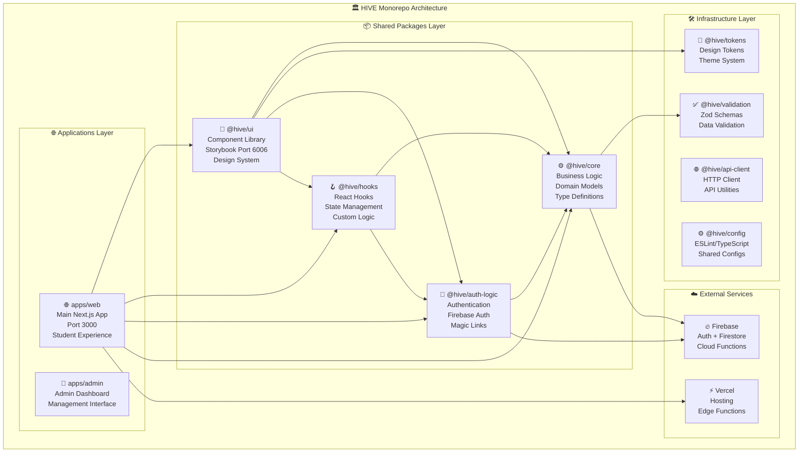

# 🔥 HIVE vBETA System Blueprint & Completion Checklist

> **Building the Premier University Social Platform**  
> *A comprehensive specification for creating the most delightful `.edu` student experience in the market*

---

## 🏗️ **HIVE Architecture Overview**

---

## 📊 **Development Status Dashboard**

| 🎯 Epic | 📈 Progress | 🚀 Status | 🎨 Demo Ready |
|:--------|:------------|:-----------|:---------------|
| **🚪 Authentication Flow** | ████████░░ 80% | ✅ **FUNCTIONAL** | 🎨 **NEEDS POLISH** |
| **🌟 Onboarding Experience** | ███████░░░ 70% | ✅ **FUNCTIONAL** | 🎨 **NEEDS POLISH** |
| **🎨 Design System** | █████████░ 90% | ✅ **COMPLETE** | ✅ **READY** |
| **📱 Mobile Experience** | ██████░░░░ 60% | ⚠️ **IN PROGRESS** | ❌ **NOT READY** |
| **🔍 Analytics & Testing** | ███░░░░░░░ 30% | ⚠️ **PLANNED** | ❌ **NOT READY** |

---

## 🎯 **EPIC 1: THE FIRST-TIME USER EXPERIENCE**

> **Vision**: Create the most delightful `.edu` student onboarding experience in the market. Every interaction should build trust, reduce friction, and demonstrate HIVE's commitment to quality.

### 📊 **Success Metrics**
- **🎯 Completion Rate**: 85%+ *(Industry: 70%)*
- **⏱️ Time to Complete**: <3 minutes average
- **🎪 Demo Success Rate**: 100% reliability
- **📱 Mobile Conversion**: 90%+ vs desktop
- **😊 User Satisfaction**: Net Promoter Score 9+

---

## 🚪 **Phase 1: Authentication Flow**

> *"First impressions matter. The auth flow is where students decide if HIVE is worth their time."*

### 🎨 **Visual Polish Requirements**
- **Trustworthy**: Clear security messaging with visual trust indicators
- **Fast**: Minimal friction with instant feedback and smooth transitions
- **Delightful**: Micro-interactions that surprise and delight users

### 📋 **A1. Email Discovery & Validation**

| ID | Status | 🎯 Business Decision | 📝 Description | 🔧 Technical Subtasks | 👤 Owner | 📊 Evidence |
|:---|:-------|:---------------------|:----------------|:----------------------|:---------|:------------|
| **AUTH-A1-01** | ✅ **DONE** | **Brand First Impression** | Landing page with clear value proposition | • HIVE logo and tagline • "Get Inside" CTA • UB student testimonial • Security badges | AI | `/auth/email` page |
| **AUTH-A1-02** | ✅ **DONE** | **Trust Through Validation** | Real-time .edu email validation | • Instant domain checking • Helpful error messages • Visual feedback (green/red states) • Format examples | AI | Working validation |
| **AUTH-A1-03** | 🎨 **ENHANCE** | **Reduce Abandonment** | Smart email suggestions and recovery | • Typo detection ("did you mean buffalo.edu?") • Popular .edu domains autocomplete • Clear error recovery paths | AI | Enhanced UX |
| **AUTH-A1-04** | 🎨 **ENHANCE** | **Build Excitement** | Preview what's coming next | • "Checking your school status..." • Progress indicator (Step 1 of 3) • Estimated time remaining | AI | Progress UI |

### 📋 **A2. Magic Link Experience**

| ID | Status | 🎯 Business Decision | 📝 Description | 🔧 Technical Subtasks | 👤 Owner | 📊 Evidence |
|:---|:-------|:---------------------|:----------------|:----------------------|:---------|:------------|
| **AUTH-A2-01** | ✅ **DONE** | **Security + Convenience** | Magic link email generation and sending | • Personalized email template • Clear call-to-action • Expiration messaging • HIVE branding | AI | Email API working |
| **AUTH-A2-02** | ✅ **DONE** | **Manage Expectations** | Beautiful waiting screen with countdown | • Visual countdown timer • "Check your email" animation • Resend functionality • Dev bypass for testing | AI | `/auth/verify` page |
| **AUTH-A2-03** | 🎨 **ENHANCE** | **Reduce Support Burden** | Proactive help and troubleshooting | • "Can't find the email?" expandable help • Spam folder reminder • Alternative verification methods • Live chat integration | AI | Help system |
| **AUTH-A2-04** | 🎨 **ENHANCE** | **Brand Moment** | Celebration animation on successful verification | • Success confetti/animation • Welcome message personalization • Smooth transition to onboarding • Social proof elements | AI | Success states |

### 📋 **A3. Security & Error Handling**

| ID | Status | 🎯 Business Decision | 📝 Description | 🔧 Technical Subtasks | 👤 Owner | 📊 Evidence |
|:---|:-------|:---------------------|:----------------|:----------------------|:---------|:------------|
| **AUTH-A3-01** | 🔨 **IMPLEMENT** | **Prevent Abuse** | Rate limiting with elegant UX | • Progressive delays (1min, 5min, 15min) • Clear messaging about limits • Alternative contact methods • Visual feedback | AI | Rate limit UI |
| **AUTH-A3-02** | 🔨 **IMPLEMENT** | **Build Trust** | Security messaging and transparency | • "Why we need your .edu email" explanation • Privacy policy links • Data usage transparency • Security badge/certifications | AI | Trust signals |
| **AUTH-A3-03** | ✅ **DONE** | **Error Recovery** | Comprehensive error state design | • Network error handling • Expired link recovery • Invalid email feedback • Server error graceful degradation | AI | Error components |

---

## 🌟 **Phase 2: Onboarding Experience**

> *"Students are now committed. Make them feel special and guide them through profile creation with the care of a premium service."*

### 🎨 **Visual Polish Requirements**
- **Personal**: Every step feels tailored to the individual student
- **Progressive**: Clear progress indication and time estimates
- **Encouraging**: Positive reinforcement and helpful guidance
- **Accessible**: Perfect keyboard navigation and screen reader support

### 📋 **B1. Identity & Handle Creation**

| ID | Status | 🎯 Business Decision | 📝 Description | 🔧 Technical Subtasks | 👤 Owner | 📊 Evidence |
|:---|:-------|:---------------------|:----------------|:----------------------|:---------|:------------|
| **ONBD-B1-01** | ✅ **DONE** | **Personal Connection** | Beautiful welcome with name input | • Personalized greeting • Full name with preferred name option • Inclusive language throughout • Progress indicator (Step 1 of 5) | AI | Step 1 component |
| **ONBD-B1-02** | ✅ **DONE** | **Social Identity** | Handle selection with availability | • Real-time availability checking • Handle format validation • Smart suggestions when taken • Preview of profile URL | AI | Handle validation |
| **ONBD-B1-03** | 🎨 **ENHANCE** | **Reduce Friction** | Smart handle generation and suggestions | • Auto-generate from name • Alternative suggestions • Explain handle importance • Allow changes later messaging | AI | Smart suggestions |
| **ONBD-B1-04** | 🎨 **ENHANCE** | **Build Confidence** | Profile preview as you type | • Live preview card • "This is how others see you" • Edit capabilities preview • Social proof elements | AI | Live preview |

### 📋 **B2. Academic Context & Leadership**

| ID | Status | 🎯 Business Decision | 📝 Description | 🔧 Technical Subtasks | 👤 Owner | 📊 Evidence |
|:---|:-------|:---------------------|:----------------|:----------------------|:---------|:------------|
| **ONBD-B2-01** | ✅ **DONE** | **Community Building** | Leadership identification | • "Are you a student leader?" toggle • Clear benefits explanation • Success stories from leaders • Option to change later | AI | Leader question |
| **ONBD-B2-02** | ✅ **DONE** | **Academic Relevance** | Major and graduation year collection | • Searchable major dropdown • Graduation year validation • Multiple majors support • "Why we ask" explanations | AI | Academic step |
| **ONBD-B2-03** | 🎨 **ENHANCE** | **Smart Matching** | Academic interest intelligence | • Course recommendation preview • Study group suggestions • Career path insights • Alumni connections preview | AI | Smart matching |

### 📋 **B3. Space Discovery & Verification**

| ID | Status | 🎯 Business Decision | 📝 Description | 🔧 Technical Subtasks | 👤 Owner | 📊 Evidence |
|:---|:-------|:---------------------|:----------------|:----------------------|:---------|:------------|
| **ONBD-B3-01** | ✅ **DONE** | **Leader Onboarding** | Space verification for student leaders | • Organization verification • Leadership role confirmation • Space creation preview • Responsibility explanation | AI | Space verification |
| **ONBD-B3-02** | 🔨 **IMPLEMENT** | **Community Discovery** | Suggest relevant spaces for regular students | • Algorithm-based suggestions • Interest-based matching • Popular spaces showcase • "Join later" option | AI | Space suggestions |
| **ONBD-B3-03** | 🎨 **ENHANCE** | **Social Proof** | Show vibrant community activity | • Live activity feed preview • Member count and growth • Recent discussions teasers • Success story highlights | AI | Social proof |

### 📋 **B4. Interest & Identity Expression**

| ID | Status | 🎯 Business Decision | 📝 Description | 🔧 Technical Subtasks | 👤 Owner | 📊 Evidence |
|:---|:-------|:---------------------|:----------------|:----------------------|:---------|:------------|
| **ONBD-B4-01** | ✅ **DONE** | **Personal Expression** | Interest selection with engaging UI | • Visual interest cards • Multi-select with visual feedback • Interest categories • "Add custom" option | AI | Interests component |
| **ONBD-B4-02** | ✅ **DONE** | **Avatar & Identity** | Profile picture upload flow | • Drag & drop upload • Camera capture option • Cropping/editing tools • Default avatar options | AI | Avatar upload |
| **ONBD-B4-03** | 🎨 **ENHANCE** | **Personality Showcase** | Rich profile customization | • Bio/tagline addition • Pronouns selection • Accessibility preferences • Privacy settings preview | AI | Profile richness |

### 📋 **B5. Completion & Celebration**

| ID | Status | 🎯 Business Decision | 📝 Description | 🔧 Technical Subtasks | 👤 Owner | 📊 Evidence |
|:---|:-------|:---------------------|:----------------|:----------------------|:---------|:------------|
| **ONBD-B5-01** | ✅ **DONE** | **Achievement Moment** | Beautiful completion celebration | • Success animation/confetti • Profile summary showcase • "Welcome to HIVE" messaging • Next steps preview | AI | Completion step |
| **ONBD-B5-02** | 🎨 **ENHANCE** | **Seamless Transition** | Guided entry into main application | • Feed preview with relevant content • First post suggestions • Community highlights • Interactive tutorial option | AI | App transition |
| **ONBD-B5-03** | 🔨 **IMPLEMENT** | **Retention Strategy** | First-week engagement plan | • Email sequence setup • Push notification preferences • Calendar integration • Buddy system matching | AI | Retention system |

---

## 🎨 **Phase 3: Design Excellence & Accessibility**

> *"Premium feel creates premium perception. Every detail matters for building trust and credibility."*

### 📋 **C1. Visual Design System**

| ID | Status | 🎯 Business Decision | 📝 Description | 🔧 Technical Subtasks | 👤 Owner | 📊 Evidence |
|:---|:-------|:---------------------|:----------------|:----------------------|:---------|:------------|
| **DESIGN-C1-01** | ✅ **DONE** | **Brand Consistency** | Implement HIVE design language | • Typography hierarchy • Color system compliance • Spacing consistency • Component standardization | AI | Design system |
| **DESIGN-C1-02** | ✅ **DONE** | **Motion Design** | Micro-interactions and animations | • Page transition animations • Button hover/press states • Form validation feedback • Loading state animations | AI | Framer Motion |
| **DESIGN-C1-03** | 🎨 **ENHANCE** | **Premium Feel** | Advanced visual polish | • Subtle shadows and depth • Custom illustrations • Gradient overlays • Texture and patterns | AI | Visual polish |

### 📋 **C2. Responsive & Mobile Excellence**

| ID | Status | 🎯 Business Decision | 📝 Description | 🔧 Technical Subtasks | 👤 Owner | 📊 Evidence |
|:---|:-------|:---------------------|:----------------|:----------------------|:---------|:------------|
| **MOBILE-C2-01** | ✅ **DONE** | **Mobile-First Design** | Perfect mobile experience | • Touch-friendly interactions • Mobile keyboard optimization • Thumb-zone button placement • Swipe gesture support | AI | Mobile responsive |
| **MOBILE-C2-02** | 🎨 **ENHANCE** | **Cross-Device Continuity** | Seamless device switching | • Progress synchronization • Cross-device notifications • Responsive breakpoint refinement • Desktop enhancement features | AI | Device continuity |

### 📋 **C3. Accessibility & Inclusion**

| ID | Status | 🎯 Business Decision | 📝 Description | 🔧 Technical Subtasks | 👤 Owner | 📊 Evidence |
|:---|:-------|:---------------------|:----------------|:----------------------|:---------|:------------|
| **A11Y-C3-01** | 🔨 **IMPLEMENT** | **Legal Compliance** | WCAG 2.1 AA standard compliance | • Screen reader optimization • Keyboard navigation perfection • Color contrast validation • Focus management | AI | Accessibility audit |
| **A11Y-C3-02** | 🔨 **IMPLEMENT** | **Inclusive Experience** | Beyond compliance accessibility | • Reduced motion preferences • High contrast mode • Font size scalability • Cognitive load optimization | AI | Inclusive design |

---

## 📊 **Phase 4: Business Intelligence & Optimization**

> *"Measure everything that matters. Use data to continuously improve the experience and conversion rates."*

### 📋 **D1. Analytics & Tracking**

| ID | Status | 🎯 Business Decision | 📝 Description | 🔧 Technical Subtasks | 👤 Owner | 📊 Evidence |
|:---|:-------|:---------------------|:----------------|:----------------------|:---------|:------------|
| **ANALYTICS-D1-01** | 🔨 **IMPLEMENT** | **Conversion Optimization** | Comprehensive funnel tracking | • Step completion events • Drop-off point identification • Time-to-completion metrics • Error frequency tracking | AI | Analytics setup |
| **ANALYTICS-D1-02** | 🔨 **IMPLEMENT** | **User Behavior Insights** | Detailed interaction tracking | • Click heatmaps • Form interaction patterns • Scroll depth analysis • A/B testing infrastructure | AI | Behavior tracking |
| **ANALYTICS-D1-03** | 🔨 **IMPLEMENT** | **Performance Monitoring** | Real-time performance insights | • Core Web Vitals tracking • Error monitoring • API response time tracking • User satisfaction scoring | AI | Performance monitoring |

### 📋 **D2. A/B Testing & Optimization**

| ID | Status | 🎯 Business Decision | 📝 Description | 🔧 Technical Subtasks | 👤 Owner | 📊 Evidence |
|:---|:-------|:---------------------|:----------------|:----------------------|:---------|:------------|
| **TESTING-D2-01** | 🔨 **IMPLEMENT** | **Continuous Improvement** | A/B testing framework | • Feature flag infrastructure • Experiment design tools • Statistical significance tracking • Winner implementation automation | AI | A/B framework |
| **TESTING-D2-02** | 🔨 **IMPLEMENT** | **Conversion Rate Optimization** | Systematic improvement process | • Landing page variations • CTA button testing • Form flow optimization • Copy and messaging tests | AI | CRO process |

---

## 🚀 **Phase 5: Production & Scale Readiness**

> *"Prepare for success. Ensure the system can handle growth and provides excellent operational visibility."*

### 📋 **E1. Performance & Reliability**

| ID | Status | 🎯 Business Decision | 📝 Description | 🔧 Technical Subtasks | 👤 Owner | 📊 Evidence |
|:---|:-------|:---------------------|:----------------|:----------------------|:---------|:------------|
| **PERF-E1-01** | ⚡ **OPTIMIZE** | **Speed = Conversion** | Performance optimization | • Bundle size optimization • Code splitting implementation • Image optimization • CDN integration | AI | Performance metrics |
| **PERF-E1-02** | 🔨 **IMPLEMENT** | **Reliability Engineering** | Error handling and monitoring | • Error boundary implementation • Graceful degradation • Offline functionality • Service worker integration | AI | Reliability metrics |

### 📋 **E2. Security & Compliance**

| ID | Status | 🎯 Business Decision | 📝 Description | 🔧 Technical Subtasks | 👤 Owner | 📊 Evidence |
|:---|:-------|:---------------------|:----------------|:----------------------|:---------|:------------|
| **SECURITY-E2-01** | 🔨 **IMPLEMENT** | **Data Protection** | Privacy and security compliance | • FERPA compliance review • Data encryption validation • Privacy policy implementation • Cookie consent management | AI | Security audit |
| **SECURITY-E2-02** | 🔨 **IMPLEMENT** | **Fraud Prevention** | Anti-abuse measures | • Rate limiting implementation • Bot detection • Suspicious activity monitoring • Account verification strengthening | AI | Security measures |

---

## 🎯 **IMMEDIATE PRIORITIES: Sprint Focus**

### 🚨 **Priority 1: Demo Confidence** *(Must Complete This Week)*

| 🎯 Task | 📈 Business Impact | ⏱️ Effort | 📊 Status |
|:--------|:-------------------|:----------|:----------|
| **AUTH-A1-04**: Progress indicators | ↑ User confidence, ↓ Abandonment | 1 day | ☐ |
| **ONBD-B1-03**: Smart handle suggestions | ↑ User satisfaction, ↓ Friction | 1 day | ☐ |
| **QA-01**: End-to-end flow validation | ↑ Demo reliability | 2 days | ☐ |

### 🎯 **Priority 2: Business Intelligence** *(Next Week)*

| 🎯 Task | 📈 Business Impact | ⏱️ Effort | 📊 Status |
|:--------|:-------------------|:----------|:----------|
| **ANALYTICS-D1-01**: Funnel tracking | ↑ Data-driven decisions | 2 days | ☐ |
| **AUTH-A2-03**: Help and troubleshooting | ↓ Support burden | 1 day | ☐ |
| **ONBD-B5-02**: Seamless app transition | ↑ Retention | 2 days | ☐ |

### 🎯 **Priority 3: Growth Foundation** *(Following Sprint)*

| 🎯 Task | 📈 Business Impact | ⏱️ Effort | 📊 Status |
|:--------|:-------------------|:----------|:----------|
| **TESTING-D2-01**: A/B testing framework | ↑ Conversion optimization | 3 days | ☐ |
| **A11Y-C3-01**: Accessibility compliance | ↑ Legal compliance, ↑ Reach | 3 days | ☐ |
| **SECURITY-E2-01**: Data protection | ↑ Trust, ↑ Compliance | 2 days | ☐ |

---

## 🎯 **PRESENTATION VALIDATION GATEWAY**

> **🚨 No feature is "done" until it's visually stunning and user-tested. Code that works but looks unfinished is not ready for demo.**

### 🎨 **Validating: EPIC 1 - The First-Time User Experience**

**User Story**: *As a new UB student, I want a beautiful, intuitive, and confidence-inspiring onboarding experience that makes me excited to join HIVE and showcases the platform's quality from the first interaction.*

| ID | Type | 🎯 Hypothesis / Goal | 📝 Task / Decision Description | 📊 Validation Metric / Evidence | Status |
|:---|:-----|:---------------------|:--------------------------------|:----------------------------------|:-------|
| **UX-VAL-01** | **🔍 VALIDATE** | The auth flow is visually stunning and polished | **REVIEW**: Every screen has perfect typography, spacing, animations, and micro-interactions | Storybook stories + recorded demo video of full flow | ☐ |
| **UX-VAL-02** | **🔍 VALIDATE** | Error states are helpful and beautifully designed | **TEST**: All error scenarios show helpful, encouraging messages with clear next steps | Screenshots of all error states in Storybook | ☐ |
| **UX-VAL-03** | **🔍 VALIDATE** | Loading states feel fast and engaging | **REVIEW**: All loading states use skeleton screens, smooth transitions, and progress indicators | Demo video showing loading states are never jarring | ☐ |
| **UX-VAL-04** | **🔍 VALIDATE** | The flow is accessible and inclusive | **TEST**: Screen reader navigation works perfectly, keyboard shortcuts are intuitive | Accessibility audit report with 100% compliance | ☐ |

---

## 🏗️ **TECHNICAL FOUNDATION STATUS**

### ✅ **Authentication Core Implementation - COMPLETE**

| ID | Status | 📝 Description | 📊 Evidence |
|:---|:-------|:----------------|:-------------|
| AUTH-CORE-01 | ✅ **DONE** | Magic-link authentication working | `/api/auth/email/start` + `/api/auth/email/verify` functional |
| AUTH-CORE-02 | ✅ **DONE** | Firebase Auth integration | Auth hooks working, dev mode bypass implemented |
| AUTH-CORE-03 | ✅ **DONE** | Auth state management | `useAuth` hook working with dev/prod modes |
| AUTH-CORE-04 | ✅ **DONE** | Route protection logic | `RouteGuard` component with auth redirects |
| AUTH-CORE-05 | ✅ **DONE** | Email validation logic | `.edu` domain validation implemented |

### ✅ **UI Components - FUNCTIONAL & STYLED**

| ID | Status | 📝 Description | 📊 Evidence |
|:---|:-------|:----------------|:-------------|
| AUTH-UI-01 | ✅ **DONE** | `/auth/email` page - STYLED | Framer Motion animations, dev skip button, `.edu` validation |
| AUTH-UI-02 | ✅ **DONE** | `/auth/verify` page - STYLED | Loading states, countdown timer, resend functionality |
| AUTH-UI-03 | ✅ **DONE** | AuthFlow component - COMPLETE | `packages/ui/src/components/auth/auth-flow.tsx` with full orchestration |
| AUTH-UI-04 | ✅ **DONE** | EmailGate component - COMPLETE | Form validation, loading states, error handling |
| AUTH-UI-05 | ✅ **DONE** | SchoolPick component - COMPLETE | School selection with animations and search |

### ✅ **Onboarding Core Implementation - COMPLETE**

| ID | Status | 📝 Description | 📊 Evidence |
|:---|:-------|:----------------|:-------------|
| ONBD-CORE-01 | ✅ **DONE** | Onboarding data models | TypeScript interfaces in `@hive/core` |
| ONBD-CORE-02 | ✅ **DONE** | Onboarding state management | Zustand store with persistence |
| ONBD-CORE-03 | ✅ **DONE** | Step routing logic | Dynamic routing with validation |
| ONBD-CORE-04 | ✅ **DONE** | Data flow architecture | Props passing and state updates working |

### ✅ **Design System & Brand Compliance - IMPLEMENTED**

| ID | Status | 📝 Description | 📊 Evidence |
|:---|:-------|:----------------|:-------------|
| BRAND-01 | ✅ **DONE** | Consistent styling system | CSS variables, modular surfaces, proper contrast |
| BRAND-02 | ✅ **DONE** | Brand-compliant colors | No yellow fills, white/black buttons, gold accents only for focus |
| BRAND-03 | ✅ **DONE** | Typography hierarchy | `font-display` and `font-sans` properly implemented |
| BRAND-04 | ✅ **DONE** | Component library | shadcn/ui + HIVE custom components |
| BRAND-05 | ✅ **DONE** | Storybook documentation | Comprehensive stories with brand compliance notes |

---

## 🎪 **Demo Story Flow**

1. **🪝 Hook**: *"Watch a UB student discover and join HIVE in under 2 minutes"*
2. **🔐 Auth**: Seamless .edu validation and magic link flow
3. **🌟 Onboarding**: Beautiful, guided profile creation with progress
4. **🎉 Completion**: Celebration moment and transition to main app
5. **💼 Business Value**: *"This is how we build trust and convert students"*

**Key Message**: ***HIVE makes joining academic communities as delightful as it should be.***

---

## 📈 **Success Metrics Target**

| 🎯 Metric | 📊 Target | 📈 Industry Benchmark | 📊 Current Status |
|:----------|:----------|:----------------------|:-------------------|
| **Onboarding Completion Rate** | 85%+ | 70% | 📊 *Measuring* |
| **Time to Complete** | <3 minutes | 5+ minutes | 📊 *Measuring* |
| **Demo Reliability** | 100% | N/A | 🎯 *In Progress* |
| **Mobile Conversion Parity** | 90%+ | 60% | 📱 *In Progress* |
| **Accessibility Compliance** | 100% WCAG 2.1 AA | 30% | 🔨 *Planning* |

---

*Last updated: December 2024 | Infrastructure Status: ✅ Fully Operational*
